## Мета: Проходження вразливої машини Deathnote (VulnHub CTF)

### Середовище: Kali Linux, VirtualBox (внутрішня мережа), Nmap, Netdiscover/ARP-scan, Hydra, SSH, CyberChef, Brainfuck-транслятор.

**Deathnote: 1** — навчальна вразлива машина з VulnHub, оформлена в стилі аніме "Death Note" (персонажі Kira, L, Misa, Ryuk тощо). На відміну від WebGoat чи Juice Shop, тут немає підказок чи покрокових уроків — потрібно самостійно пройти повний цикл: розвідку, знаходження облікових даних, отримання початкового доступу (foothold) та підвищення привілеїв.

### Цілі
* Знайти вразливу машину в локальній мережі та визначити відкриті сервіси.
* Зібрати з вебресурсу список потенційних імен користувачів та паролів.
* Підібрати робочі облікові дані для SSH методом брутфорсу.
* Отримати початковий доступ (shell) до машини.
* Пройти ланцюжок захованих підказок (Brainfuck, Hex, Base64) до пароля іншого користувача.
* Підвищити привілеї до користувача, що входить у групу **sudo**.

---

### Основні терміни:
* **VulnHub** — платформа з навмисно вразливими віртуальними машинами для практики пентесту.
* **Footprinting / Recon** — збір інформації про ціль (IP, порти, сервіси).
* **Brute-force (Hydra)** — підбір облікових даних методом перебору за словниками.
* **Foothold** — перший здобутий доступ до системи (звичайний shell без привілеїв).
* **Privilege escalation** — підвищення прав доступу в системі (від звичайного користувача до root).
* **Encoding chain (Hex → Base64 → Brainfuck)** — ланцюжок кодувань, що навмисно ускладнює отримання прихованої інформації (не є шифруванням у криптографічному сенсі, лише обфускація).

### Хід виконання

#### Крок 1. Розвідка мережі
Перевірила мережеві налаштування атакуючої машини (`ip a`) — Kali отримала адресу **192.168.12.3** в внутрішній мережі VirtualBox:

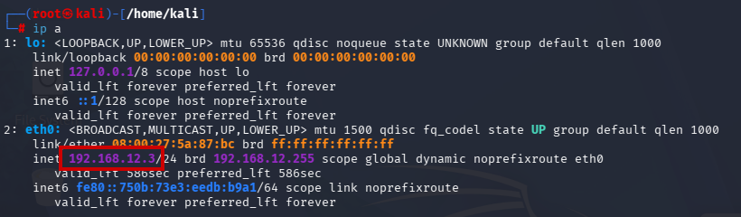

За допомогою сканера ARP-пакетів (netdiscover -r 192.168.12.0/24) знайшла в мережі другий хост — **192.168.12.4** (окрім шлюзу 192.168.12.2):

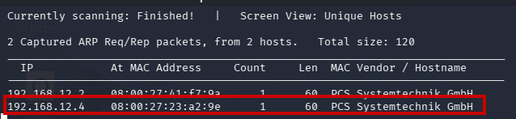

Просканувала знайдений хост **Nmap**: відкриті порти **22/tcp (ssh)** та **80/tcp (http)**:

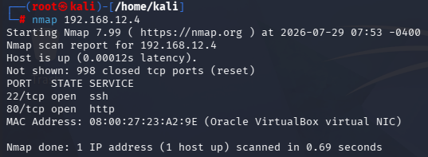

#### Крок 2. Налаштування DNS та веброзвідка
Спроба відкрити сайт за доменним іменем **deathnote.vuln** одразу не спрацювала — браузер не міг знайти хост, оскільки ім'я не резолвиться:

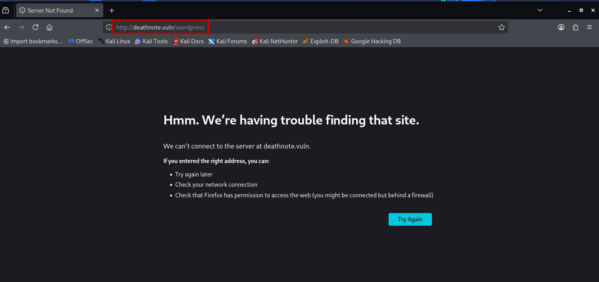

Додала відповідний запис у файл **`/etc/hosts`** (`192.168.12.4 deathnote.vuln`), прив'язавши доменне ім'я до IP-адреси машини:

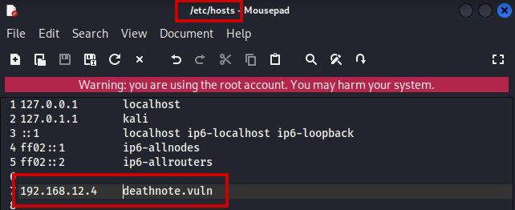

Після цього перейшла на сайт і після аналізу вихідного коду сторінки (через **view page source** )знайшла відкриту директорію завантажень WordPress **`/wordpress/wp-content/uploads/2021/07/`** зі списком файлів (зображення з логотипом "Kira"):

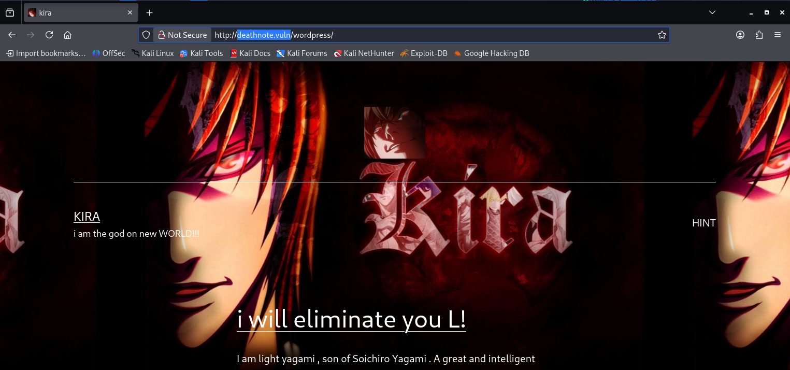
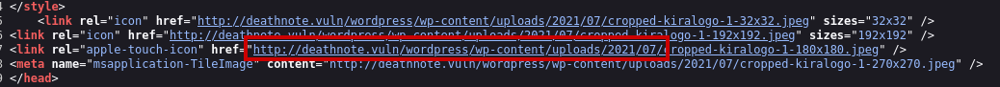

#### Крок 3. Пошук списків користувачів та паролів
У тій самій директорії завантажень знайшла і завантажила (`wget`) файл **`notes.txt`**:

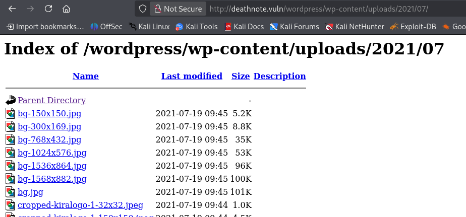
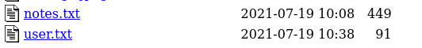
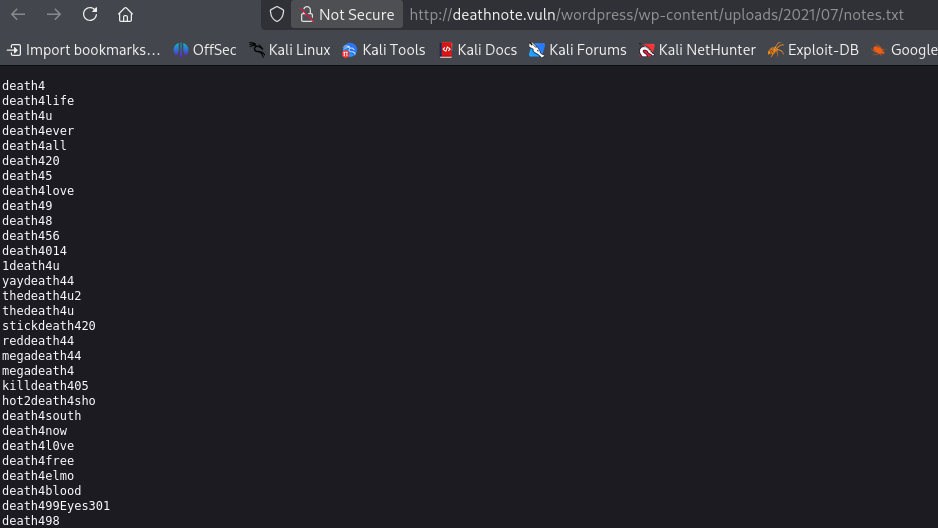
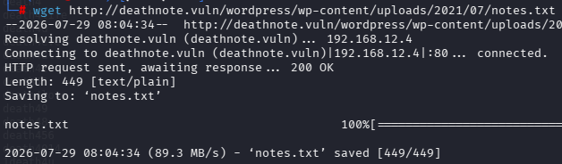

А також файл **`user.txt`**, що містив список імен персонажів аніме (потенційних логінів системи): `KIRA, L, ryuk, rem, misa, siochira, light, takada, near, mello`:

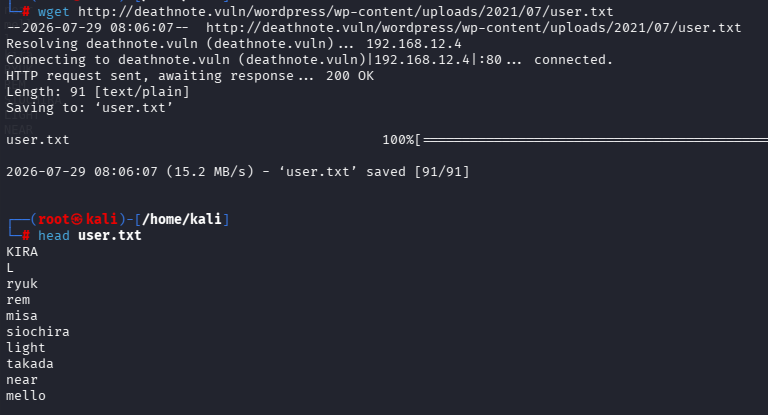

#### Крок 4. Брутфорс SSH (Hydra)
Використала знайдені файли як словники для атаки на SSH-сервіс: **`user.txt`** — як список логінів (`-L`), **`notes.txt`** — як список паролів (`-P`):
```
hydra -L user.txt -P notes.txt ssh://192.168.12.4
```
Через деякий час Hydra знайшла робочу пару облікових даних — **логін `l`, пароль `death4me`**:

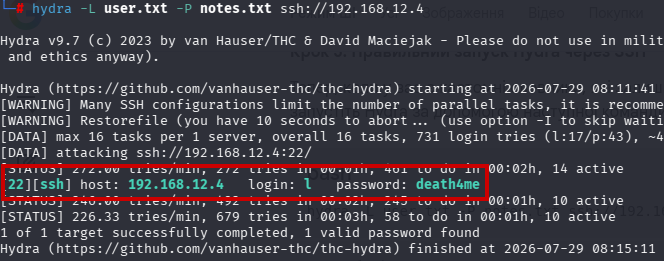

#### Крок 5. Отримання початкового доступу (foothold)
Підключилась по SSH під знайденими обліковими даними (`ssh l@192.168.12.4`), успішно авторизувалась і отримала shell від імені звичайного користувача **l** (uid=1000, без прав sudo):

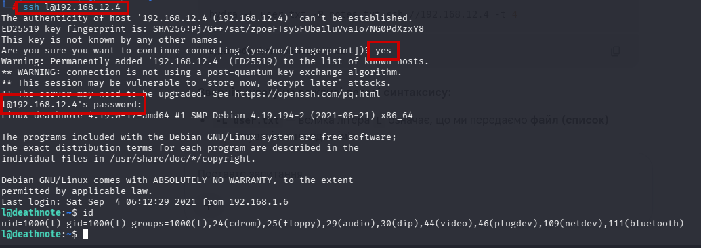

#### Крок 6. Перша захована підказка — Brainfuck
У домашній директорії користувача **l** файл **`user.txt`** містив не прапор (flag), а текст, закодований мовою езотеричного програмування **Brainfuck**:

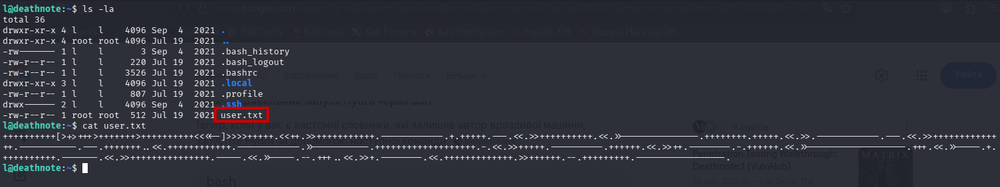

Розкодувала цей текст за допомогою онлайн Brainfuck-транслятора та отримала повідомлення від імені персонажа **Kira**: *"i think u got the shell, but you wont be able to kill me -kira"*:

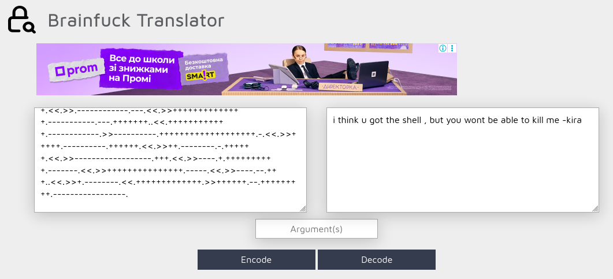

#### Крок 7. Пошук слідів користувача Kira
Скориставшись `find -name "kira*"`, знайшла кілька пов'язаних шляхів: **`/home/kira`**, **`/home/kira/kira.txt`**, зображення логотипу Kira у WordPress-директорії та запис **`/var/lib/sudo/lectured/kira`**. Спроба прочитати `/home/kira/kira.txt` напряму дала відмову в доступі (**Permission denied**), а спроба `sudo cat` показала, що користувач **l** взагалі не входить у файл **sudoers** (*"l is not in the sudoers file. This incident will be reported"*), про що вже було сказано вище:

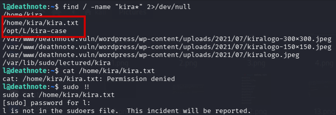

#### Крок 8. Розслідування "справи" у /opt/L/kira-case
У директорії **`/opt/L/kira-case/`** знайшла файл **`case-file.txt`** із сюжетним текстом-підказкою: про смерть агента ФБІ 27 грудня 2006 року, розслідування, пов'язане із родиною **Соіширо Ягамі**, та натяк, що щось важливе також заховано в директорії **`fake-notebook-rule`**:

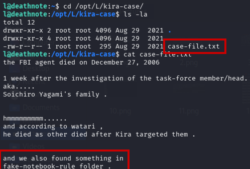

#### Крок 9. Аудіофайл-підказка (fake-notebook-rule)
За `find -name "fake-notebook-rule"` знайшла директорію **`/opt/L/fake-notebook-rule/`**, у якій лежали файл **`case.wav`** та файл-підказка **`hint`**. Вміст `hint` прямо вказував: **"use cyberchef"**. Сам файл `case.wav`, попри розширення `.wav`, насправді містив не аудіодані, а рядок шістнадцяткових (hex) байтів:

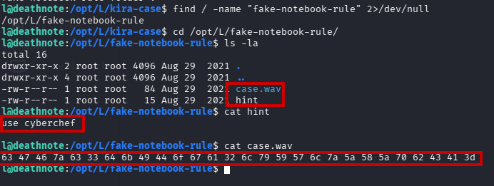

#### Крок 10. Декодування ланцюжка Hex → Base64 (CyberChef)
Вставила вміст `case.wav` у **CyberChef**. Спершу застосувала операцію **"From Hex"** — отримала проміжний результат, який сам виявився рядком у **Base64**:

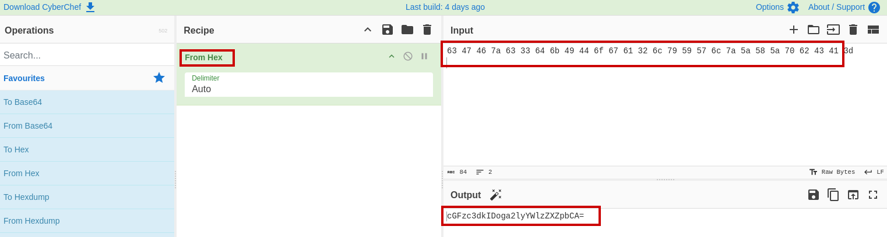

Додавши до рецепта ще й операцію **"From Base64"** (тобто застосувавши подвійне декодування Hex → Base64 в одному ланцюжку), отримала фінальний результат — рядок **`passwd : kiraisevil`**:

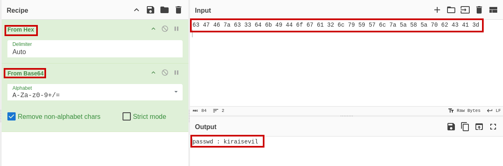

#### Крок 11. Підвищення привілеїв до користувача Kira
Знайдений рядок виявився паролем. Виконала перехід на обліковий запис **kira** (`su kira`) з паролем **`kiraisevil`** — вхід успішний. Перевірка (`id`) показала, що користувач **kira** (uid=1001) входить у групу **`sudo`** — тобто має можливість виконувати команди з підвищеними привілеями:

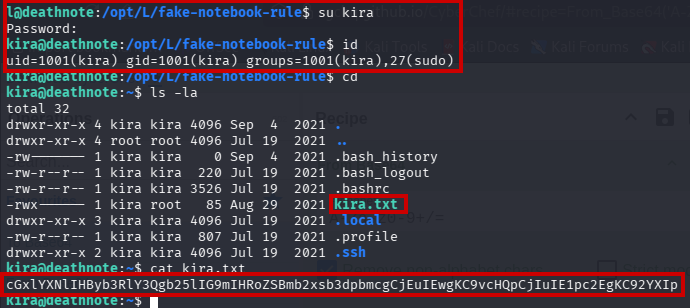

#### Крок 12. Наступна підказка з домашньої директорії Kira
У домашній директорії **kira** файл **`kira.txt`** містив ще один рядок, закодований у **Base64**. Декодувавши його в CyberChef, отримала текстову підказку:
```
please protect one of the following
1. L (/opt)
2. Misa (/var)
```

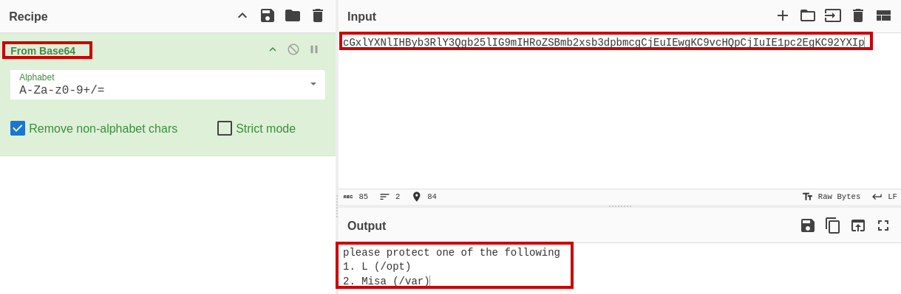

Ця підказка вказує напрямок для подальшого підвищення привілеїв до **root** — через одну з директорій **`/opt`** (пов'язану з користувачем L) або **`/var`** (пов'язану з Misa), що є наступним кроком дослідження машини.

Щоб отримати права суперкористувача необхідно використати той самий пароль, що й є для користувача Kira. В директорії /root знаходитсья текстовий файл, який містить привітання з успішним проходженням машини (**root.txt**)

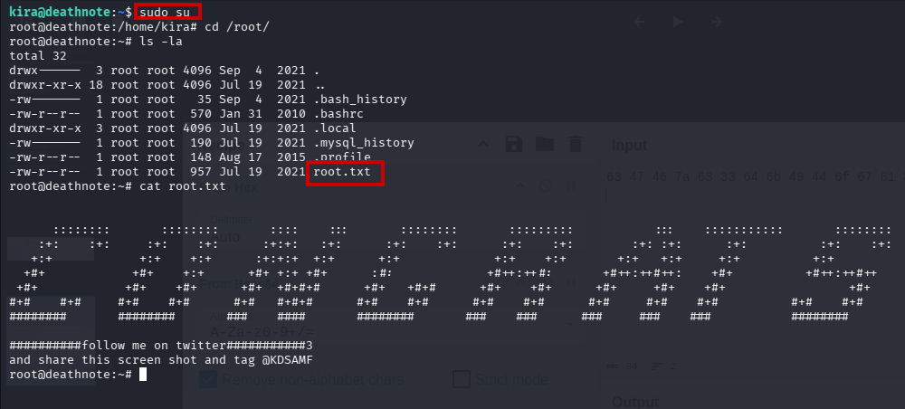

### Висновок

У ході проходження CTF-машини **Deathnote: 1** було успішно виконано повний цикл початкового етапу пентесту: розвідку мережі та сервісів, збір облікових даних із відкритої веброзсурсу, брутфорс SSH-доступу, отримання foothold-shell та подальше підвищення привілеїв до користувача **kira**, який входить у групу **sudo**. Особливістю цієї машини є багатошаровий ланцюжок закодованих підказок (Brainfuck → сюжетні файли → Hex → Base64), що імітує "розслідування" в стилі аніме Death Note і вимагає уважності до, на перший погляд, неважливих деталей (назви файлів, коментарі, метадані сторінок) для просування далі.
