## Мета: Встановлення та налаштування Suricata IDS на Ubuntu для моніторингу мережевого трафіку

### Середовище: Ubuntu 24.04.4 LTS (VirtualBox, IP 192.168.0.137), SSH, Suricata 8.0.6, suricata-update, jq, testmynids.org.

**Suricata** — система виявлення (та запобігання) вторгнень з відкритим кодом (IDS/IPS/NSM). Мета роботи — встановити Suricata на Ubuntu, налаштувати її на прослуховування мережевого інтерфейсу, підключити правила виявлення (offical rulesets + власні правила), перевірити роботу на реальному трафіку та проаналізувати згенеровані алерти.

### Цілі
* Підготувати сервер Ubuntu: оновити систему та встановити SSH-доступ.
* Підключити офіційний PPA-репозиторій та встановити Suricata останньої стабільної версії.
* Визначити мережевий інтерфейс сервера та налаштувати Suricata на захоплення трафіку саме на ньому (af-packet).
* Коректно вказати домашню мережу (`HOME_NET`) у конфігурації.
* Оновити базу правил (`suricata-update`) та запустити службу.
* Перевірити роботу IDS на тестовому трафіку (testmynids.org) та проаналізувати логи (`fast.log`, `eve.json`, `stats.log`).
* Написати власні кастомні правила (`local.rules`) для виявлення підозрілої активності (HTTP-методи, SSH, ICMP, DNS, спроби доступу до `/admin`, `.git`, SQLi тощо).
* Виявити та проаналізувати помилки при завантаженні власних правил, зробити висновки щодо коректного синтаксису.
* Провести повторний тест і підтвердити спрацювання як стандартних, так і кастомних правил на живому трафіку.

---

### Основні терміни:
* **IDS (Intrusion Detection System)** — система виявлення вторгнень, яка аналізує мережевий трафік і сигналізує про підозрілу активність, не блокуючи її (на відміну від IPS).
* **af-packet** — режим захоплення трафіку в Linux, який Suricata використовує для швидкого зчитування пакетів безпосередньо з мережевого інтерфейсу.
* **HOME_NET** — змінна в конфігурації Suricata, що визначає межі "своєї" (внутрішньої) мережі; від неї залежить логіка багатьох правил (напрямок трафіку, класифікація).
* **suricata-update** — офіційна утиліта для завантаження та оновлення наборів правил (rulesets), зокрема Emerging Threats Open.
* **fast.log** — стислий текстовий лог алертів Suricata (одна подія — один рядок).
* **eve.json** — розширений структурований (JSON) лог усіх подій Suricata: алерти, статистика, DNS, HTTP, TLS тощо.
* **sid (Signature ID)** — унікальний ідентифікатор правила виявлення.
* **local.rules** — файл для власних, кастомних сигнатур, які підключаються окремо від офіційних наборів правил.

### Хід виконання

#### Крок 1. Підготовка сервера
Для початку я визначила IP-адресу машини Ubuntu:

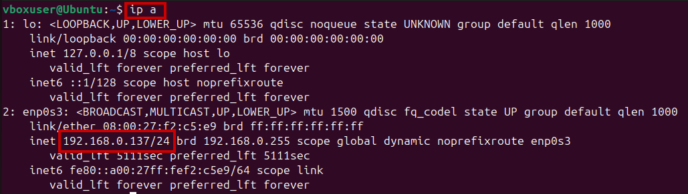

Оновила список пакетів та встановила SSH-сервер для віддаленого підключення до машини:
```
sudo apt update
sudo apt install openssh-server -y
```

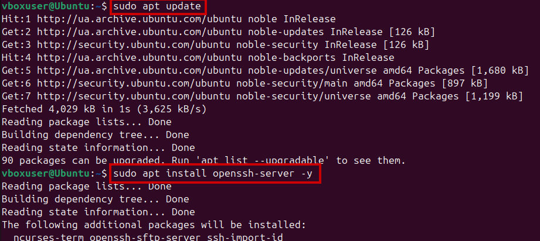

Далі запустила сервіс SSH та перевірила його статус:

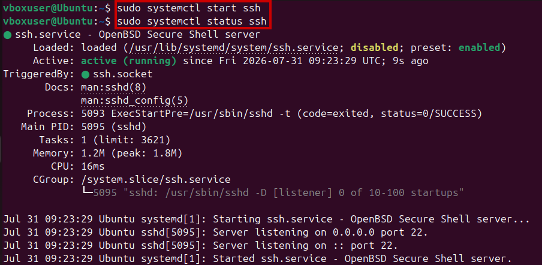

Підключилась до сервера по SSH з робочої станції:
```
ssh vboxuser@192.168.0.137
```
Підтвердила автентичність хоста (`yes`) та ввела пароль користувача — підключення успішне, отримала доступ до **Ubuntu 24.04.4 LTS**:

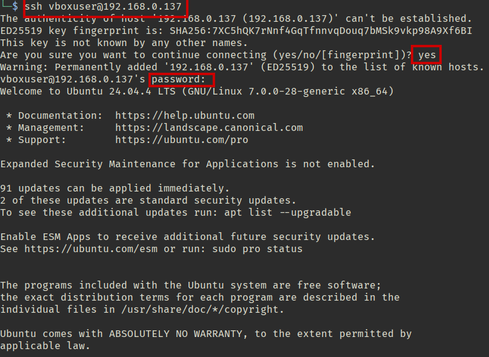

#### Крок 2. Підключення репозиторію Suricata та встановлення
Встановила пакет `software-properties-common`, необхідний для роботи з PPA-репозиторіями:
```
sudo apt-get install software-properties-common -y
```

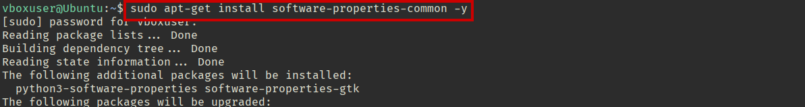

Додала офіційний стабільний PPA-репозиторій Suricata (**OISF**):
```
sudo add-apt-repository ppa:oisf/suricata-stable -y
```

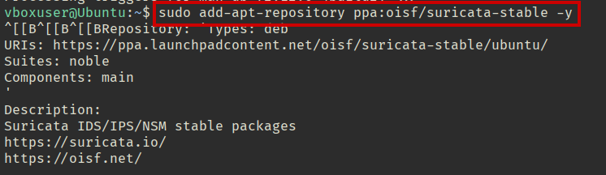

Оновила список пакетів, щоб підхопити новий репозиторій:
```
sudo apt update
```

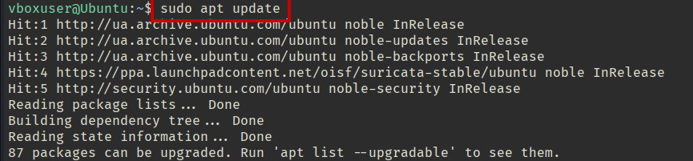

Встановила саму Suricata та перевірила версію й зібрані функції командою `suricata --build-info`. Отримала **Suricata 8.0.6 RELEASE** з підтримкою `AF_PACKET`, `HAVE_JA3`, `HAVE_JA4`, `TLS`, `RUST` та інших модулів:

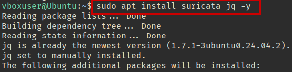
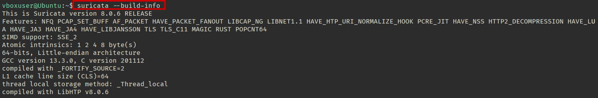

Під час перевірки статусу виявила, що Suricata не активна, для того, щоб вона запустилась без помилок потрібно змінити файл конфігурацій:

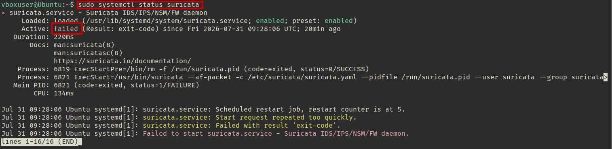

#### Крок 3. Визначення мережевого інтерфейсу
Переглянула список мережевих інтерфейсів командою:
```
ip link show
```
Виявила робочий інтерфейс **`enp0s3`** (окрім `lo`):

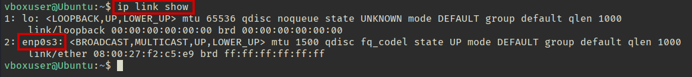

Вказала цей інтерфейс у конфігураційному файлі `/etc/suricata/suricata.yaml`, у секції захоплення трафіку `af-packet`:
```yaml
af-packet:
  - interface: enp0s3
```

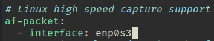

#### Крок 4. Налаштування HOME_NET
У тому ж конфігураційному файлі в секції `vars → address-groups` вказала точну домашню мережу замість широких дефолтних діапазонів (це підвищує точність спрацювання правил і продуктивність):
```yaml
HOME_NET: "[192.168.0.0/24]"
```

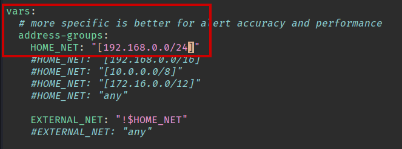

Після перезапуску сервісу статус показує, що Suricata активна:

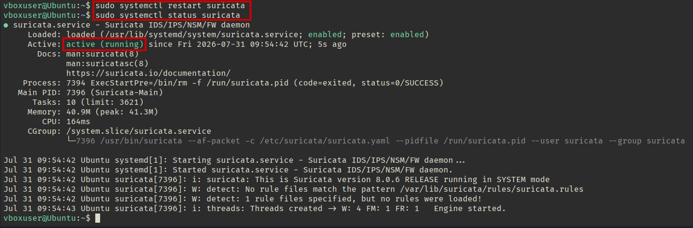

#### Крок 5. Оновлення правил та запуск Suricata
Завантажила та оновила набори правил утилітою `suricata-update` (за замовчуванням підключаються правила **Emerging Threats Open**, вимкнено правила для протоколів pgsql, modbus, dnp3, enip — вони не використовуються в цьому середовищі):
```
sudo suricata-update
```

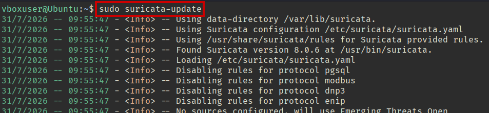

Перезапустила службу та перевірила лог запуску — Suricata стартувала в **IDS-режимі** (`live mode`), ініціалізувала вихідні файли логів `fast.log`, `eve.json`, `stats.log`:
```
sudo systemctl restart suricata
sudo tail /var/log/suricata/suricata.log
```

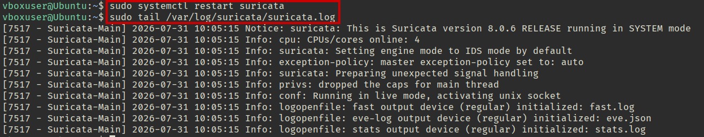

#### Крок 6. Перевірка статистики роботи
Переглянула статистику роботи движка в реальному часі:
```
sudo tail -f /var/log/suricata/stats.log
```
Побачила лічильники використання пам'яті (`defrag.memuse`, `tcp.memuse`, `flow.memuse` тощо), кількість оброблених пакетів (`capture.kernel_packets`), тощо — система активно захоплює трафік:

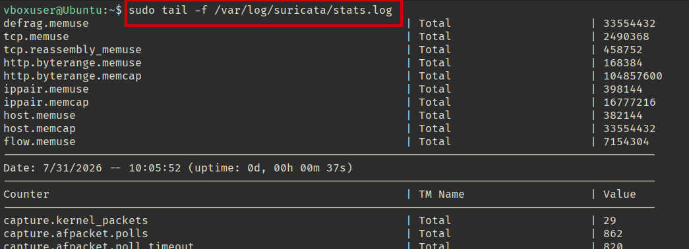

#### Крок 7. Перевірка на тестовому трафіку (testmynids.org)
Для перевірки роботи виявлення виконала запит до спеціального тестового ресурсу **testmynids.org**, який імітує підозрілу відповідь сервера (за аналогією з EICAR-тестом для антивірусів):
```
curl http://testmynids.org/uid/index.html
```
Отримала відповідь `uid=0(root) gid=0(root) groups=0(root)`:

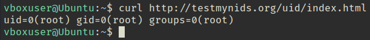

Одразу перевірила `fast.log` — Suricata згенерувала два алерти: **ET INFO GNU/Linux APT User-Agent Outbound** (звичайний трафік менеджера пакетів) та **GPL ATTACK_RESPONSE id check returned root** — саме той сигнатурний алерт, який підтверджує коректну роботу движка виявлення на реальному трафіку:
```
sudo tail -f /var/log/suricata/fast.log
```

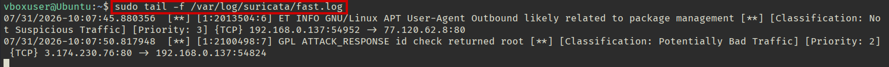

Додатково переглянула ту саму подію у структурованому вигляді через `eve.json`, відфільтрувавши записи типу `stats` за допомогою `jq`:
```
sudo tail -f /var/log/suricata/eve.json | jq 'select(.event_type=="stats")'
```

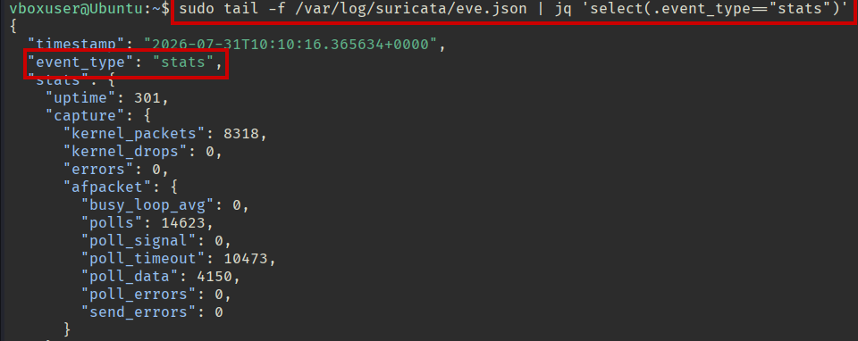

#### Крок 8. Написання власних правил (local.rules)
Відкрила файл кастомних сигнатур `/var/lib/suricata/rules/local.rules` та створила кілька власних правил для базового моніторингу типової підозрілої активності:

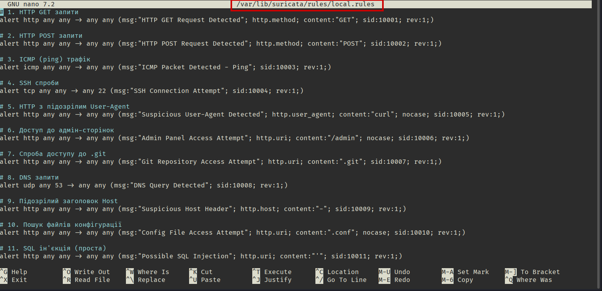

Підключила файл `local.rules` до основного конфігу поряд зі стандартним набором `suricata.rules` у секції `rule-files`:
```yaml
rule-files:
  - suricata.rules
  - local.rules
```

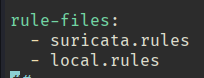

#### Крок 9. Виявлення помилок при завантаженні правил
При перезапуску служби та ручному запуску Suricata у verbose-режимі для перевірки на конкретному інтерфейсі:
```
sudo systemctl restart suricata
sudo suricata -c /etc/suricata/suricata.yaml -i enp0s3 -v
```
Виявила, що **два додаткові правила** (написані пізніше, для виявлення command injection через символ `;` та `|`, `sid:20014` і `sid:20015`) не завантажились через синтаксичні помилки:
* `Invalid unescaped double quote within content section` (некоректно екранована лапка в правилі з `;`);
* `Invalid hex code assembly in content` (некоректна hex-послідовність у правилі з символом `|`, який у Suricata зарезервований для hex-нотації в `content`).

Загалом успішно завантажилось **52183 правила**, **2 правила не пройшли** парсинг, **0 пропущено**. Також отримала попередження `Error: af-packet: fanout not supported by kernel` — не критична проблема, пов'язана з версією ядра/кластеризацією af-packet:

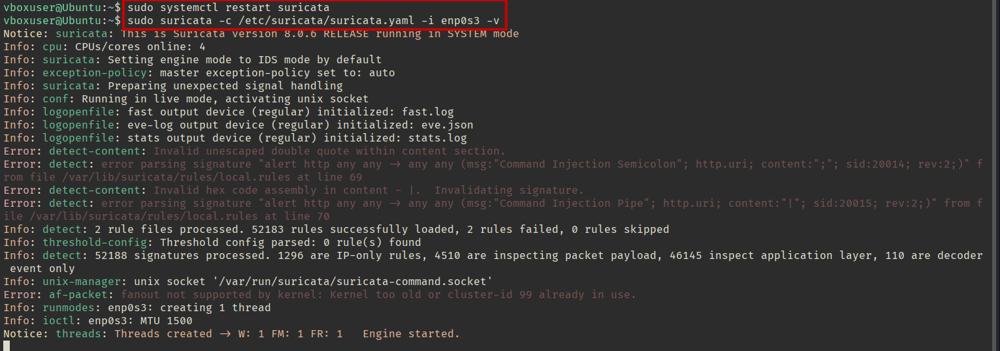

#### Крок 10. Повторна перевірка спрацювання правил на живому трафіку
Після перезапуску служби (з робочими правилами, за винятком двох помилкових) знову спостерігала за `fast.log`:
```
sudo tail -f /var/log/suricata/fast.log
```
Зафіксувала спрацювання одразу кількох правил на реальному трафіку:
* Стандартні алерти **ET INFO** та **ATTACK_RESPONSE**, отримані раніше;
* Власне тестове правило **`[10001:1] Test rule`** — багаторазово спрацювало на трафік між хостом **185.125.190.101** та локальною машиною **192.168.0.137**;
* Правило **SSH Connection Attempt (`sid:10004`)** — спрацювало на TCP-з'єднання до порту **22** з адреси **192.168.0.124**;
* Правило **ICMP Packet Detected (`sid:10003`)** — спрацювало на ICMPv6-трафік (ping) між локальними IPv6-адресами;
* Правило **DNS Query Detected (`sid:10008`)** — спрацювало на UDP-трафік до DNS-порту **53**.

Це підтвердило, що власні кастомні правила коректно виявляють відповідні типи трафіку в реальному часі:

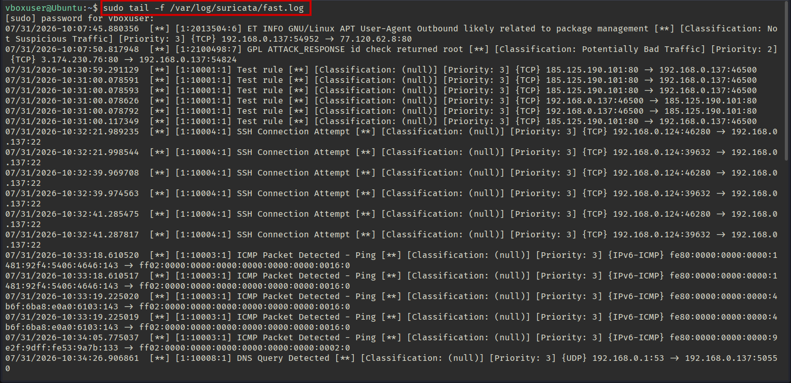
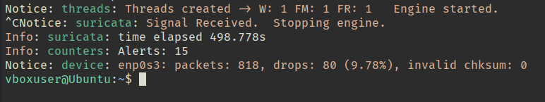

### Висновок

У межах роботи Suricata IDS була повністю розгорнута та налаштована на сервері **Ubuntu 24.04.4 LTS**: встановлення через офіційний PPA-репозиторій **OISF**, налаштування захоплення трафіку через **af-packet** на реальному інтерфейсі `enp0s3`, коректне визначення **HOME_NET**, оновлення стандартного набору правил через `suricata-update`. Робота движка виявлення підтверджена як на контрольованому тестовому трафіку (**testmynids.org**), так і на реальному мережевому трафіку. Додатково написано та підключено **набір власних правил (`local.rules`)** для базового моніторингу типової підозрілої активності (HTTP-методи, SSH, ICMP, DNS, доступ до чутливих шляхів, SQL-ін'єкції). У процесі виявлено й проаналізовано типові помилки синтаксису Suricata-правил (некоректне екранування спецсимволів у `content`), що дало практичне розуміння обмежень мови сигнатур. Фінальна перевірка на живому трафіку підтвердила коректну та стабільну роботу як стандартних, так і власних правил виявлення.
