## Мета: Знайомство з OWASP Juice Shop

### Середовище: Kali Linux, Docker engine, OWASP Juice Shop container, Burp Suite, CyberChef.

**OWASP Juice Shop** — навмисно вразливий вебзастосунок (інтернет-магазин соків), створений для навчання практичній безпеці. На відміну від WebGoat, тут немає покрокових уроків із теорією — застосунок побудований у форматі гейміфікованих **"challenges" (челенджів)**: потрібно самостійно знайти вразливість і "розв'язати" її, після чого система автоматично зараховує бал на **Score Board**.

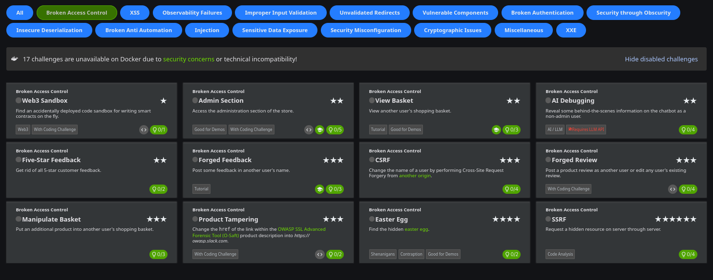

### Концепція
Juice Shop охоплює практично всю категорію **OWASP Top 10** — від Broken Access Control та Injection до XSS, небезпечної десеріалізації та невірної конфігурації безпеки. Кожен челендж має рівень складності і прихований (за замовчуванням) опис у вихідному коді фронтенду — саме тому пошук службової **дошки результатів (Score Board)** зазвичай є першим кроком у роботі з застосунком.

### Цілі
* Знайти приховану сторінку **Score Board** через інструменти розробника.
* Обійти клієнтську фільтрацію та автентифікацію (Missing Encoding, Error Handling, вхід під адміном через SQL-ін'єкцію).
* Знайти приховані файли та "пасхальне яйце" через FTP-директорію застосунку.
* Обійти перевірку типу файлу за допомогою **Poison Null Byte**.
* Виконати **DOM-based XSS** через пошукове поле та завантаження аудіофайлу.
* Отримати доступ до конфіденційного документа компанії.
* За допомогою **Burp Suite** переглянути кошик іншого користувача (IDOR).

---

### Основні терміни:
* **Score Board** — прихована службова сторінка Juice Shop зі списком усіх челенджів та прогресом їх виконання.
* **Coding Challenge** — додаткове завдання переглянути та вказати вразливий фрагмент вихідного коду, що спричиняє знайдену вразливість, а потім обрати правильний варіант виправлення (**Fix It**).
* **Missing/Broken Encoding** — некоректна обробка спеціальних символів (наприклад, `#`) у назвах файлів чи URL.
* **Error Handling** — витік технічної інформації через необроблені винятки.
* **Poison Null Byte** — техніка обходу перевірки розширення файлу шляхом додавання нульового байта, який обриває рядок для функції перевірки розширення, але не для функції читання файлу.
* **DOM-based XSS** — міжсайтовий скриптинг, що виконується безпосередньо в DOM-дереві на клієнті.
* **IDOR (Insecure Direct Object Reference)** — можливість звернутися до чужого об'єкта (наприклад, кошика) лише змінивши його ідентифікатор у запиті.

### Хід виконання

#### Крок 1. Пошук Score Board через DevTools
Відкрила застосунок і, оскільки посилання на **Score Board** немає в жодному меню, скористалась вбудованими інструментами розробника браузера. У вкладці **Debugger** відкрила файл `main.js` і через пошук по коду (`Ctrl+F`) знайшла рядок з роутом, що містить `"score-board"` серед масиву маршрутів застосунку:

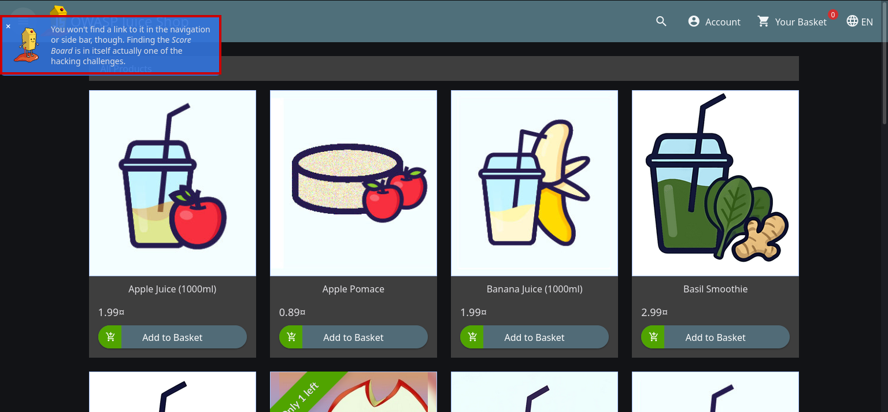
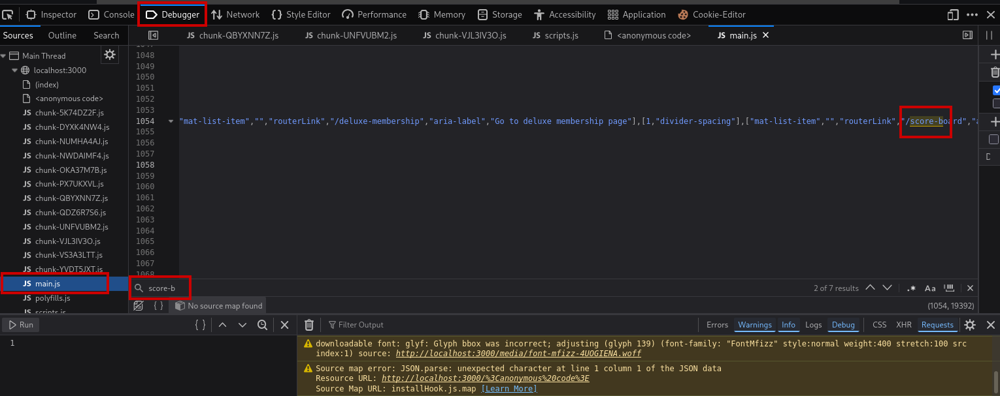

Підставивши знайдений шлях у адресний рядок (`http://localhost:3000/#/score-board`), потрапила на приховану сторінку дошки результатів — челендж **"Score Board"** зараховано, видно список категорій та лічильники розв'язаних завдань:

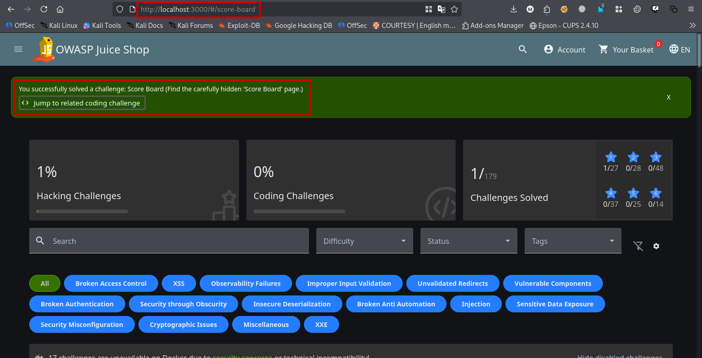

#### Крок 2. Coding Challenge (Score Board)
Одразу після знаходження Score Board натиснула **"Jump to related coding challenge"**. У блоці **Find It** потрібно було клікнути на рядок(и) коду, що містять вразливість — виділила рядок `path: 'score-board'` у масиві маршрутів (саме відсутність `canActivate`-guard дозволяє будь-кому відкрити цей маршрут без перевірки прав):

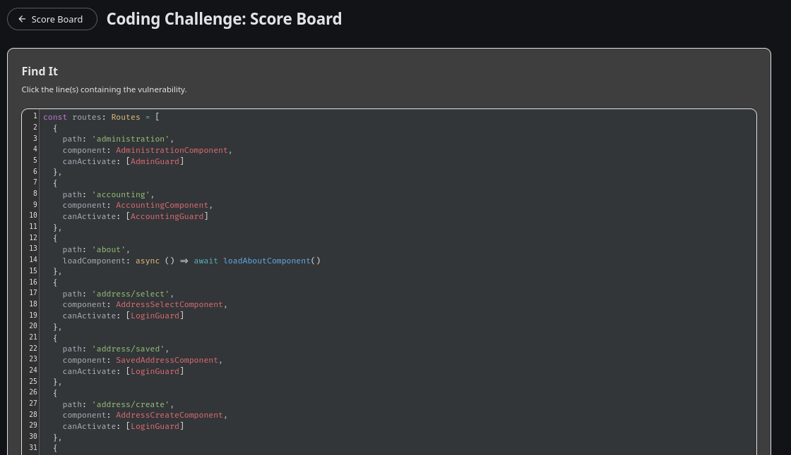

У блоці **Fix It** з трьох запропонованих варіантів виправлення обрала **Fix 3** — залишити код без змін (оскільки цей маршрут навмисно має залишатись доступним для відстеження прогресу челенджів, і "виправлення" тут зламало б саму механіку Score Board):

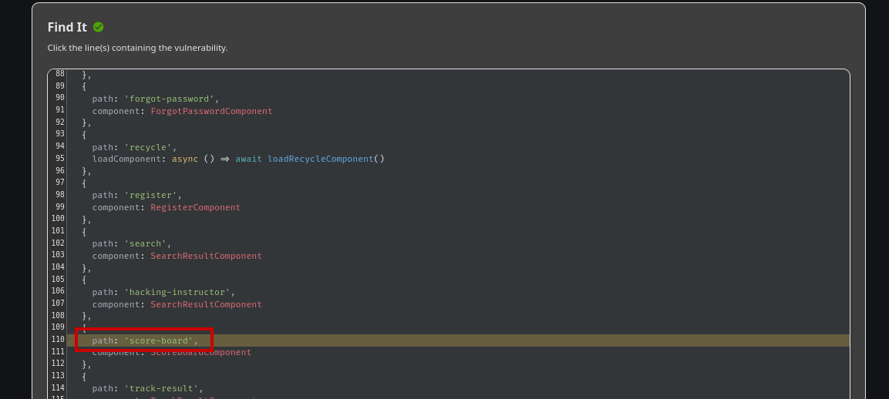
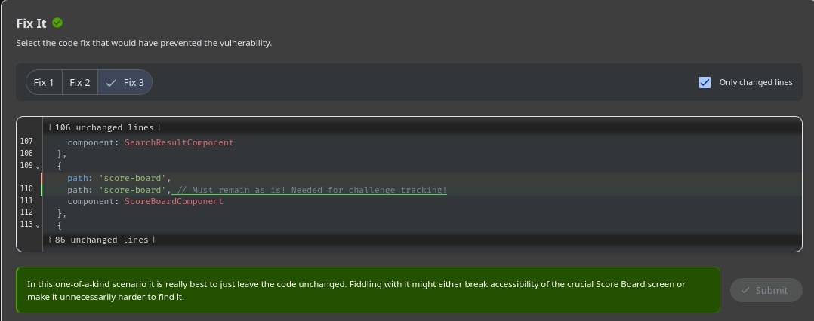

#### Крок 3. Missing Encoding
На сторінці **Photo Wall** через інспектор елементів переглянула розмиті фото та їхній HTML: одне з фото мало `alt="🐱 #zatschi #whoneedsfourlegs"`, а в атрибуті `src` символ `#` у назві файлу (`c😾-#zatschi-#whoneedsfourlegs...jpg`) не був URL-закодований, через що браузер обривав шлях на цьому символі і фото не завантажувалось:

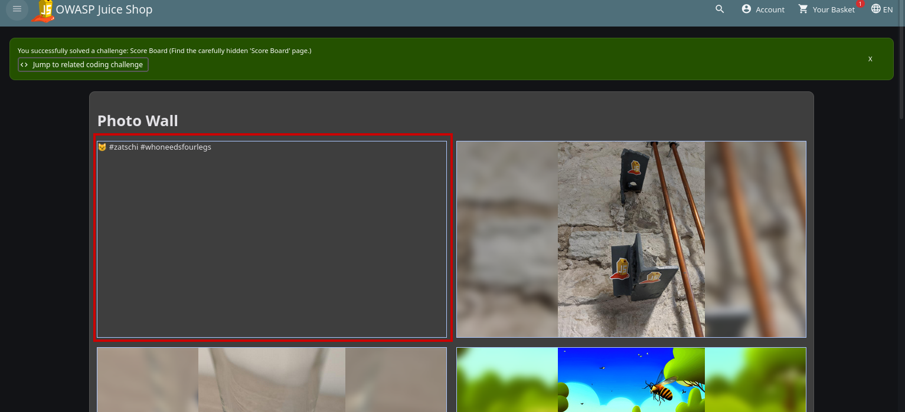
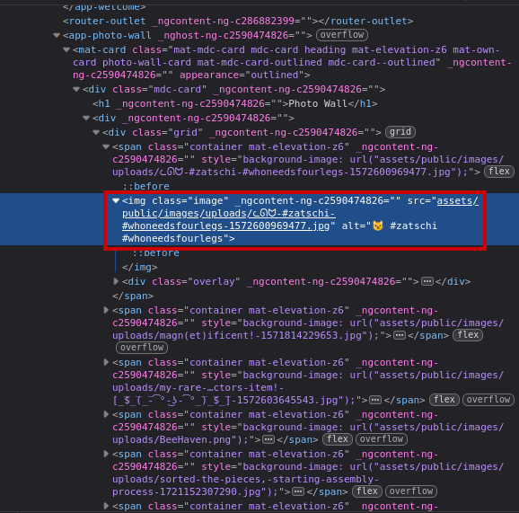

Замінила в адресному рядку/атрибуті `src` символ `#` на його URL-кодоване значення **`%23`** та перейшла за виправленим посиланням — фото кота Бйорна в "melee combat-mode" успішно завантажилось, челендж **"Missing Encoding"** зараховано:

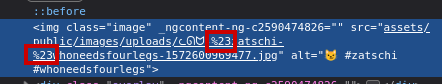
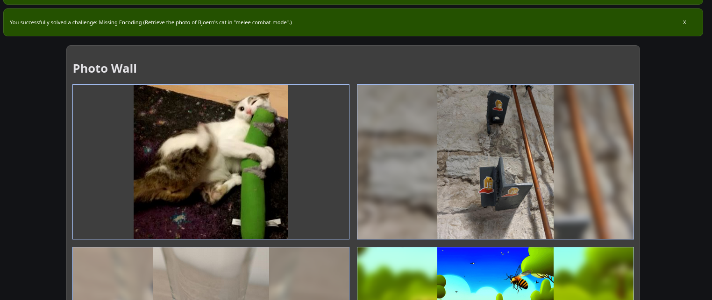

#### Крок 4. Error Handling
На формі логіну в поле **Email** ввела одну одинарну лапку (`'`), а в поле пароля — довільний текст, і натиснула **Log in**. Замість коректного повідомлення про помилку застосунок показав необроблений виняток — **`[object Object]`** прямо на екрані форми, що свідчить про відсутність належної обробки помилок на клієнті:

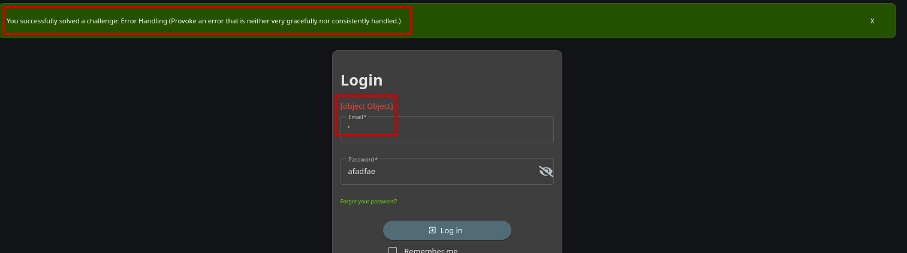

Челендж **"Error Handling"** (Provoke an error that is neither very gracefully nor consistently handled) зараховано.

#### Крок 5. Вхід під адміністратором через SQL-ін'єкцію
Скориставшись тим, що лапка спричиняє помилку в SQL-запиті на бекенді, ввела в поле **Email** класичний payload рядкової ін'єкції:
```
' OR '1'='1';--
```
Поле пароля залишила довільним. Запит на бекенді (`SELECT * FROM Users WHERE email = '...' AND password = '...'`) через ін'єкцію перетворився на умову, що завжди істинна, і **вибрав першого користувача з таблиці — адміністратора**, залогінивши мене під його обліковим записом без знання реального пароля:

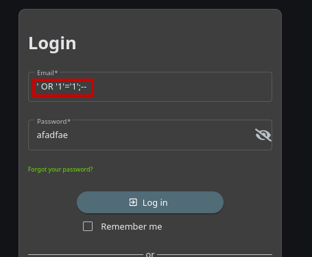
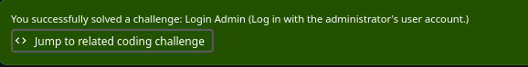

Челендж **"Login Admin"** (Log in with the administrator's user account) зараховано.

#### Крок 6. Coding Challenge (вхід під адміном)
У пов'язаному coding challenge в блоці **Find It** виділила рядок, де SQL-запит формується через **конкатенацію рядка (template literal)** без параметризації:
```js
models.sequelize.query(`SELECT * FROM Users WHERE email = '${req.body.email || ''}' AND password = '${security.hash(req.body.password || '')}'`)
```

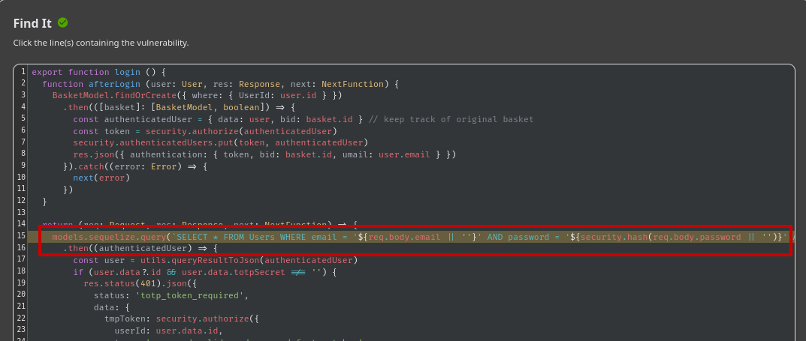

У блоці **Fix It** обрала варіант, що замінює цей запит на **параметризований (prepared statement)** з іменованими параметрами (`$1`, `$2`) замість прямої підстановки рядків — саме таке рішення унеможливлює SQL-ін'єкцію:

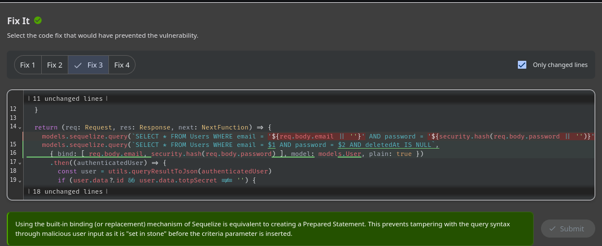

#### Крок 7. Пасхальне яйце та Poison Null Byte
Перевірила файл `robots.txt` застосунку та побачила директиву `Disallow: /ftp` — це натякнуло на існування директорії `/ftp`, яку не повинні індексувати пошукові системи:

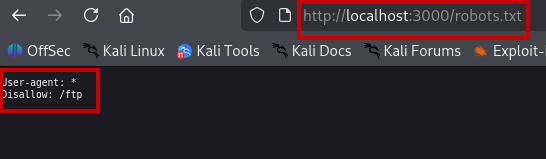

Перейшла за адресою `http://localhost:3000/ftp` і отримала лістинг директорії з файлами, серед яких — файл без розширення **`eastere.gg`**:

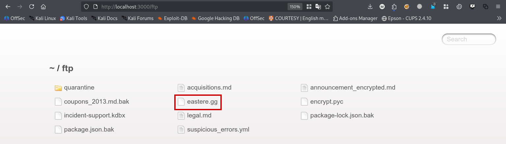

Спроба відкрити файл напряму (`/ftp/eastere.gg`) видала помилку **403: Only .md and .pdf files are allowed!**, оскільки серверний фільтр перевіряє розширення файлу:

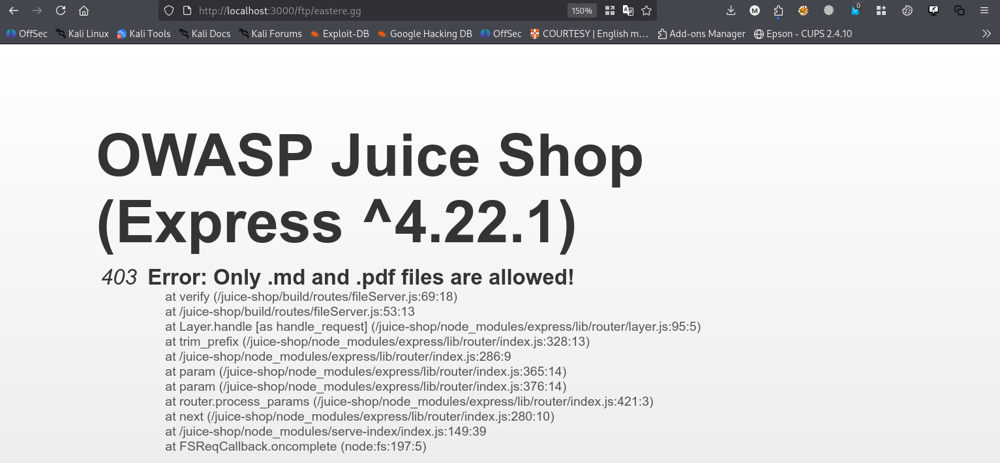

Обійшла цю перевірку технікою **Poison Null Byte** — додала до імені файлу закодований нульовий байт із "дозволеним" розширенням: `/ftp/eastere.gg%2500.md`. Функція перевірки розширення побачила рядок, що закінчується на `.md`, і пропустила запит, тоді як функція читання файлу на файловій системі обрізала рядок на нульовому байті й фактично відкрила оригінальний `eastere.gg`:

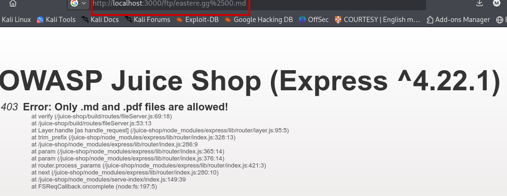

Файл завантажився на диск як `eastere.gg_00.md`:

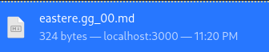

Відкрила його в текстовому редакторі — усередині був жартівливий текст розробників, а наприкінці рядок, закодований у **Base64**:

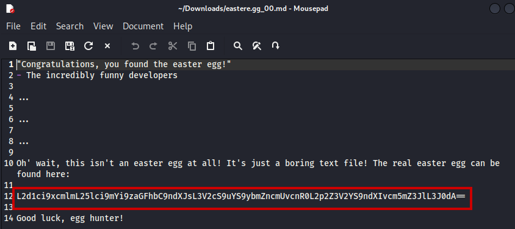

Скопіювала цей рядок у **CyberChef**, застосувала операцію **"From Base64"** — отриманий результат виявився додатково закодованим шифром **Caesar/ROT13** (текст на кшталт `gur ... ner ... rnfgre rtt`, де `gur` = ROT13 від "the"). Застосувала до результату **ROT13**, отримавши реальний шлях до "справжнього" пасхального яйця:

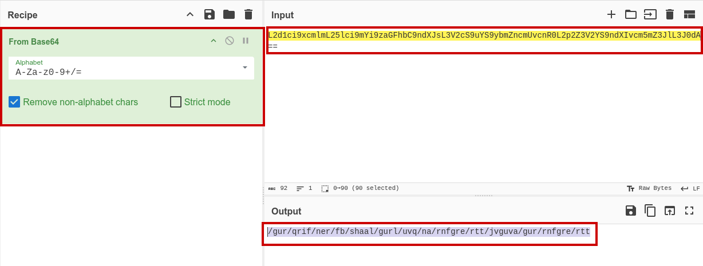
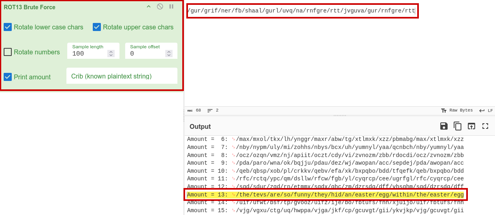

Перейшовши за розшифрованим шляхом у застосунку, отримала одразу два зарахованих челенджі:
* **Easter Egg** (Find the hidden easter egg)
* **Poison Null Byte** (Bypass a security control with a Poison Null Byte to access a file not meant for your eyes)

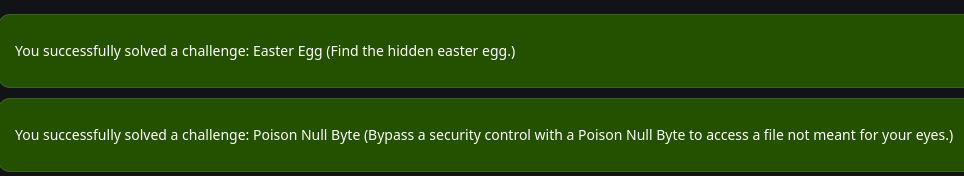

#### Крок 8. DOM XSS та Bonus Payload
У пошуковому полі застосунку ввела payload:
```html
<iframe src="javascript:alert(`xss`)">
```
Скрипт виконався прямо в DOM без участі сервера — вискочило діалогове вікно з текстом **"xss"**, що підтвердило вразливість **DOM XSS**:


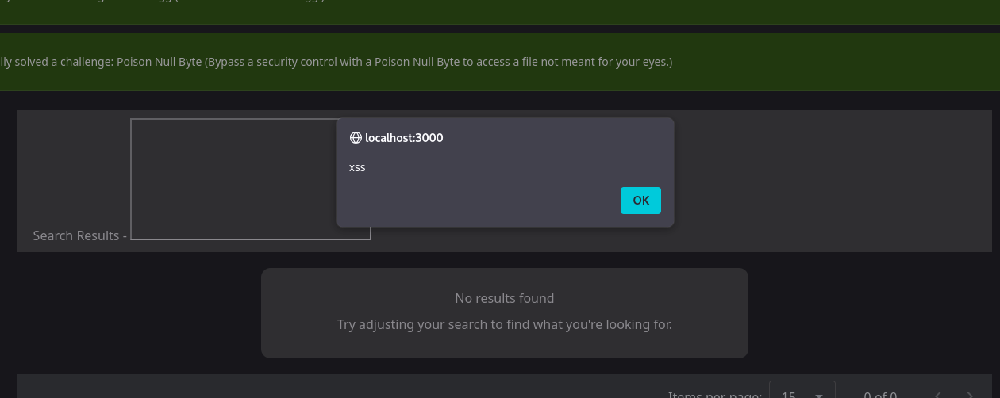

Додатково, для челенджу **"Bonus Payload"**, у те саме поле пошуку ввела наперед заданий у описі завдання спеціальний **iframe-payload** з вбудованим аудіоплеєром SoundCloud (офіційний джингл OWASP Juice Shop) — застосунок коректно відрендерив цей iframe із аудіо, і челендж також зарахувано:

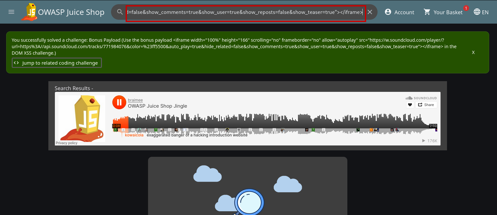

Пройшла пов'язаний coding challenge: у блоці **Find It** виділила рядок, де перед виводом пошукового значення викликається:
```ts
this.searchValue = this.sanitizer.bypassSecurityTrustHtml(queryParam)
```
— саме виклик `bypassSecurityTrustHtml` навмисно відключає вбудовану санітизацію Angular:

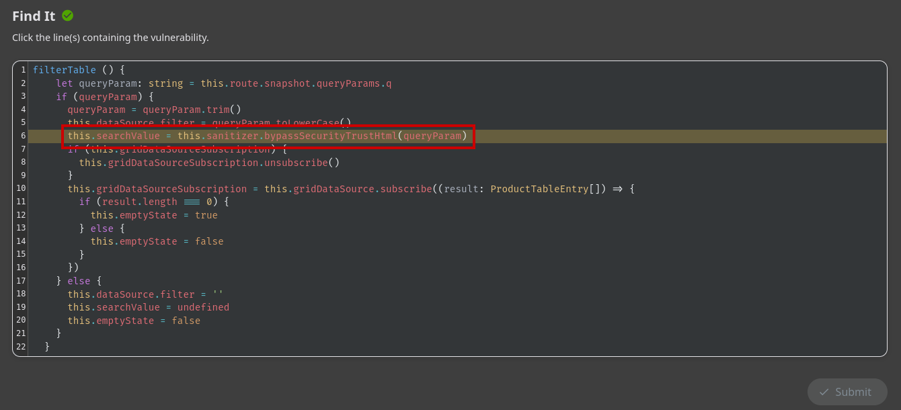

У **Fix It** обрала варіант, що повністю прибирає виклик `bypassSecurityTrustHtml` і присвоює `searchValue` без обходу санітизації:

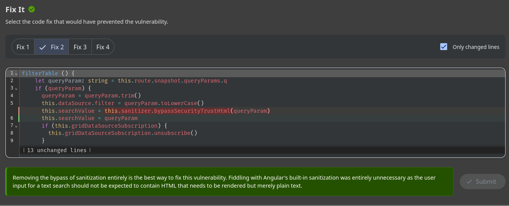

#### Крок 9. Confidential Document
У тій самій директорії **`/ftp`**, де знаходилось пасхальне яйце, серед файлів (`acquisitions.md`, `legal.md`, `incident-support.kdbx`, `package.json.bak` тощо) знайшла та відкрила файл із конфіденційною внутрішньою інформацією компанії — доступ до якого не мав бути дозволений звичайному відвідувачу сайту. Челендж **"Confidential Document"** (Access a confidential document) зараховано:

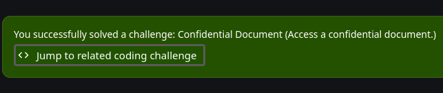

Перейшла за посиланням **"Jump to related coding challenge"** і в блоці **Find It** виділила рядки серверної маршрутизації, що обслуговують директорію `/ftp` (`app.use('/ftp', ...)`, `app.use('/ftp(?!/quarantine)/:file', servePublicFiles())`), через які будь-який файл із цієї теки, окрім `quarantine`, є публічно доступним:

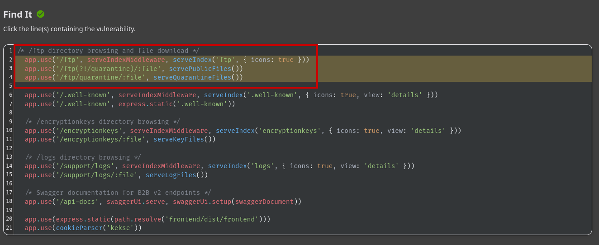

У **Fix It** обрала варіант, що прибирає публічну роздачу директорії `/ftp` повністю, оскільки правильним рішенням є взагалі не тримати внутрішні документи в загальнодоступній статичній теці:

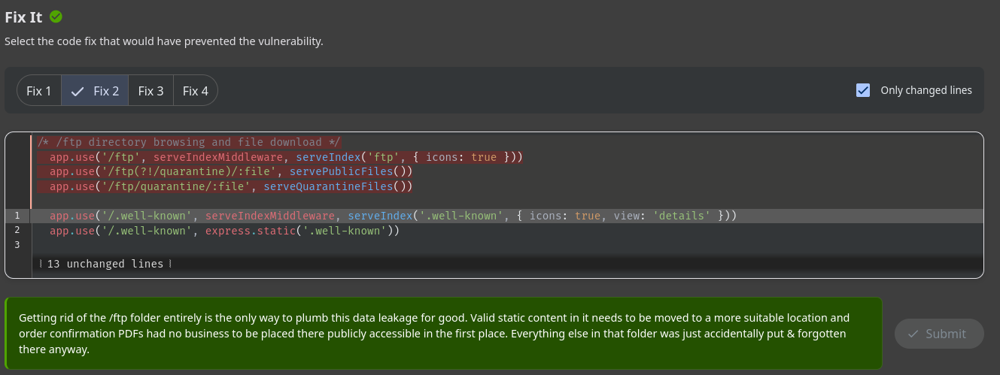

#### Крок 10. View Basket через IDOR у Burp Suite
Для останнього завдання скористалась **Burp Suite**. Увійшовши в застосунок під власним акаунтом, відкрила свій кошик і в перехопленому запиті побачила звернення `GET /rest/basket/6` із заголовком `Authorization: Bearer <JWT-токен>` — число `6` в шляху виявилось прямим ідентифікатором мого власного кошика:

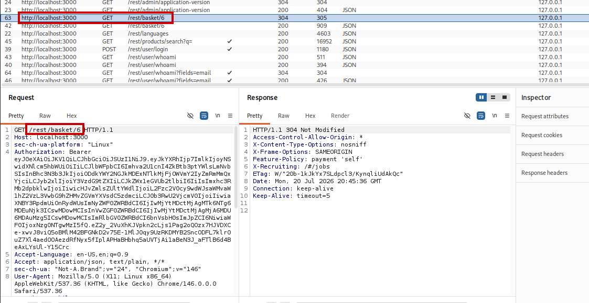

Відправила цей запит у **Repeater** і просто замінила ідентифікатор кошика з `6` на `7`, залишивши той самий JWT-токен авторизації. Сервер не перевірив, чи належить кошик з `id=7` саме моєму користувачу, і повернув **200 OK** з даними чужого кошика:

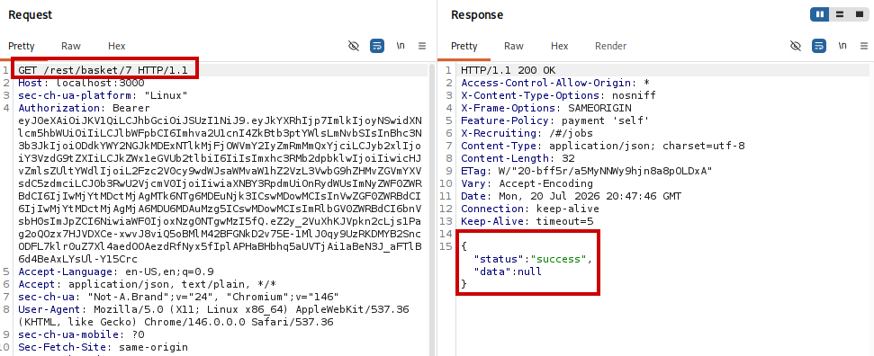

Челендж **"View Basket"** (View another user's shopping basket) зараховано:

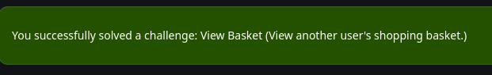

Загальний прогрес виконаних челенджів на Score Board на момент завершення роботи:

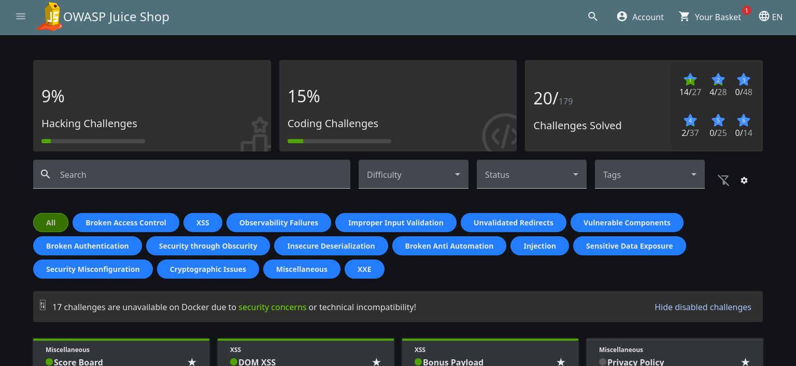

### Висновок

У ході роботи з **OWASP Juice Shop** було знайдено приховану службову сторінку Score Board через аналіз клієнтського коду, а також продемонстровано низку типових вразливостей вебзастосунків: витік технічної інформації через необроблені помилки, обхід автентифікації через **SQL-ін'єкцію**, некоректну обробку спеціальних символів у назвах файлів, обхід перевірки типу файлу через **Poison Null Byte**, виконання **DOM-based XSS** через пошукове поле, доступ до конфіденційних документів через відкриту FTP-директорію та, нарешті, класичне порушення контролю доступу — перегляд чужого кошика (**IDOR**) шляхом простої зміни числового ідентифікатора в запиті через **Burp Suite Repeater**. Робота наочно показує, наскільки різноманітними можуть бути вектори атак навіть у межах одного застосунку.
