## Мета: Знайомство з A01:2025 Broken Access Control (Hijack a Session)

### Середовище: Kali Linux, Docker engine, OWASP WebGoat container, Burp Suite.

Знайомство з категорією **A01:2025 Broken Access Control** на прикладі уроку **"Hijack a session"** у WebGoat.

В меню WebGoat обираємо відповідний урок і переглядаємо постановку завдання:

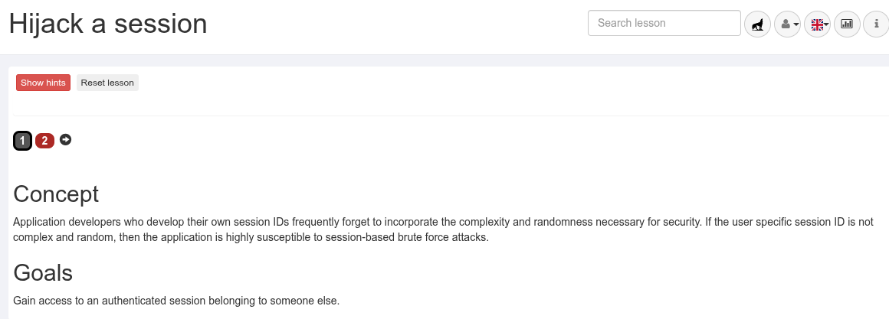

### Концепція
Розробники прикладного програмного забезпечення, які створюють власні ідентифікатори сесій (session IDs), часто забувають забезпечити рівень складності та рандомізації, необхідний для безпеки. Якщо специфічний ідентифікатор сесії користувача не є складним і випадковим, додаток стає надзвичайно вразливим до атак типу «brute force» (перебір) на сесії.

### Цілі
Отримати доступ до автентифікованої сесії, що належить іншому користувачу.

---

### Основні терміни:
* **Session ID** — ідентифікатор сесії.
* **Complexity and randomness** — складність та випадковість.
* **Brute force attacks** — атаки методом грубої сили (перебору).
* **Authenticated session** — автентифікована сесія (сеанс).

### Хід виконання

У цьому уроці потрібно передбачити значення **«hijack_cookie»**. Цей cookie використовується WebGoat для розрізнення автентифікованих та анонімних користувачів.

Запускаємо Burp Suite, переходимо на вкладку **Proxy**, вмикаємо перехоплення (**Intercept**) і відкриваємо вбудований браузер Burp:

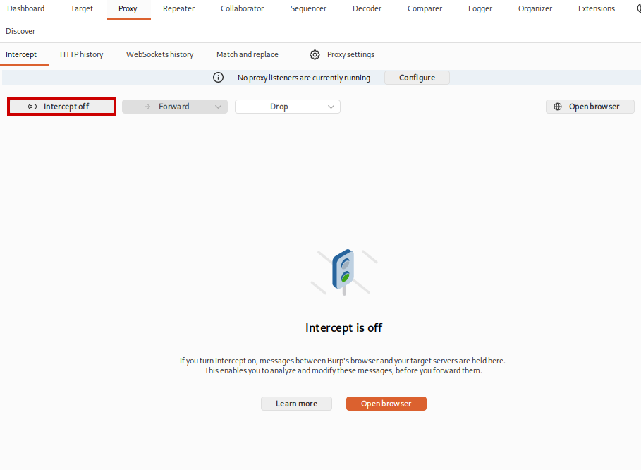

У вбудованому браузері відкриваємо WebGoat, логінимось під своїм користувачем та переходимо до другого кроку уроку. Вводимо логін і пароль у формі **Account Access** та натискаємо кнопку **Access**:

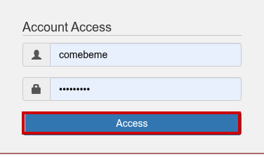

Отримуємо повідомлення про помилку **"Sorry the solution is not correct, please try again."** (наразі не видно, так як ввімкнене перехоплення) — це очікувано, адже cookie ще не підібраний. Повертаємось у Burp Suite та переглядаємо вкладку **HTTP history**, де шукаємо потрібний **POST**-запит:

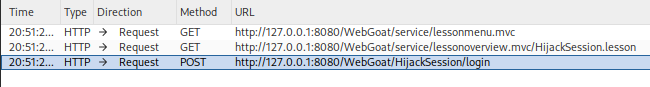

Відкриваємо запит і бачимо його вміст (логін/пароль, заголовки, cookie **JSESSIONID**):

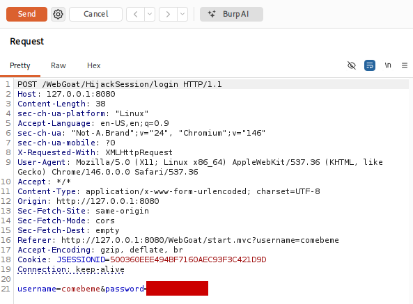

У відповіді (**Response**) на цей запит бачимо заголовок **Set-Cookie** зі значенням **hijack_cookie**, а також повідомлення про помилку в тілі відповіді — саме це значення cookie нам і потрібно навчитись передбачувати:

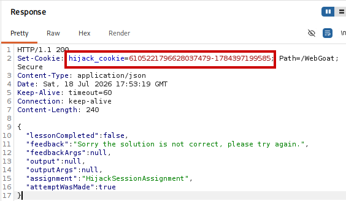

Натискаємо праву кнопку миші на запиті та відправляємо його до **Repeater**. У Repeater робимо декілька повторних відправлень запиту, кожного разу підставляючи актуальне значення **hijack_cookie** у заголовок **Cookie**:

Кожного разу після відправлення фіксуємо нове значення **hijack_cookie**, яке повертає сервер, і виписуємо ці значення у текстовий редактор для аналізу:

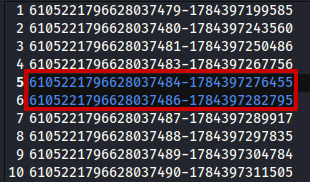

Навіть поверхневий аналіз зібраних значень дає висновок про логіку створення cookie: перша частина відповідає за номер сесії користувача (послідовно зростає на 1), а друга частина, найімовірніше, є **часовою міткою (timestamp)**. Аналізуючи послідовність значень, помічаємо, що між двома сусідніми запитами пропущена одна сесія — саме її і потрібно підібрати.

Обираємо один із запитів із Repeater (той, що передує "пропущеній" сесії) і відправляємо його до **Intruder**. У запиті замінюємо номер сесії в значенні **hijack_cookie** на очікуваний (пропущений) номер, а часову мітку розбиваємо так, щоб останні цифри стали позицією для перебору (payload):

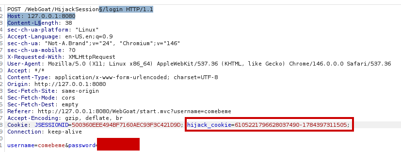
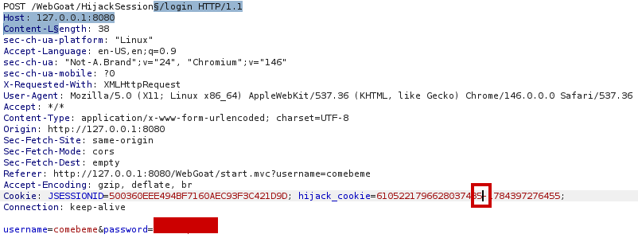

Налаштовуємо тип payload — **Numbers**, задаємо діапазон значень (From / To) та крок 1, охоплюючи можливий інтервал часової мітки:

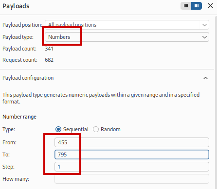

Запускаємо **Start attack** і спостерігаємо за результатами перебору. Практично одразу знаходимо запит, відповідь на який відрізняється від решти статус-кодом (**200** замість **505**) та довжиною відповіді — це і є вірне значення **hijack_cookie**:

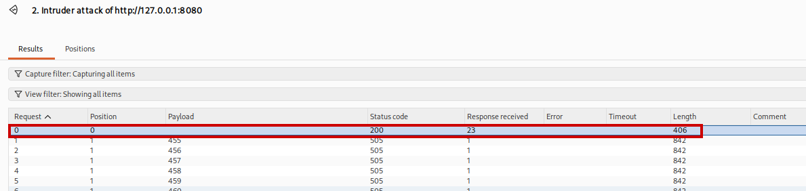

Перевіряємо тіло відповіді знайденого запиту — сервер підтверджує успішне виконання завдання:

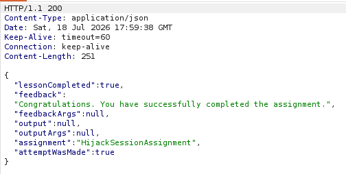

Повертаємось до інтерфейсу WebGoat: вкладка уроку змінила колір із червоного на зелений, що означає успішне проходження:

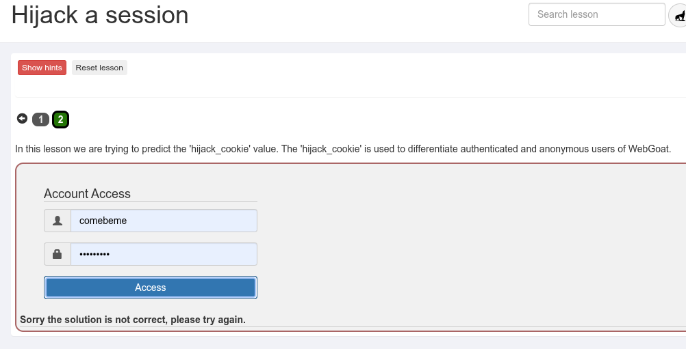

### Висновок

Лабораторну роботу виконано успішно. Було продемонстровано вразливість типу **Broken Access Control**, спричинену недостатньою складністю та випадковістю власної реалізації ідентифікатора сесії (**hijack_cookie**). Аналіз послідовних значень cookie дозволив виявити передбачувану структуру (номер сесії + timestamp), а використання **Burp Suite Repeater** та **Intruder** — підібрати відсутнє значення й отримати доступ до "чужої" автентифікованої сесії методом легкого brute force перебору.
