## Мета: Знайомство з A01:2025 Broken Access Control (Insecure Direct Object References)

### Середовище: Kali Linux, Docker engine, OWASP WebGoat container, Burp Suite.

Знайомство з категорією **A01:2025 Broken Access Control**, цього разу на прикладі уроку **"Insecure Direct Object References" (IDOR)**.

### Концепція
**Прямі посилання на об'єкти (Direct Object References)** виникають тоді, коли застосунок використовує дані, надані клієнтом (наприклад, ID у URL), для безпосереднього доступу до об'єктів на сервері — без належної перевірки прав доступу. Якщо такий ідентифікатор можна змінити (наприклад, `.../profile/12345` → `.../profile/12346`) і отримати доступ до чужих даних або можливості їх редагувати — таке посилання вважається **небезпечним (Insecure)**. Вразливими можуть бути не лише **GET**-запити на читання даних, а й **POST/PUT/DELETE**-запити, що змінюють дані.

### Цілі
* Автентифікуватись у застосунку та переглянути власний профіль.
* Знайти в "сирій" відповіді сервера дані, яких немає на екрані.
* Підібрати альтернативний шлях (прямий об'єктний ідентифікатор) для перегляду власного профілю.
* Використавши цей шаблон, переглянути профіль **іншого** користувача.
* Змінити (відредагувати) профіль іншого користувача, зловживши як горизонтальним, так і вертикальним контролем доступу.

---

### Основні терміни:
* **IDOR (Insecure Direct Object Reference)** — небезпечне пряме посилання на об'єкт.
* **Broken Access Control** — порушення контролю доступу.
* **Horizontal access control** — горизонтальний контроль доступу (доступ до даних користувача з такою ж роллю).
* **Vertical access control** — вертикальний контроль доступу (підвищення привілеїв до вищої ролі).
* **RESTful pattern** — підхід до побудови API, де ресурс і дія визначаються шляхом (path) та HTTP-методом.

### Хід виконання

#### Крок 1. Автентифікація
Логінимось у застосунку під обліковим записом **tom / cat**:

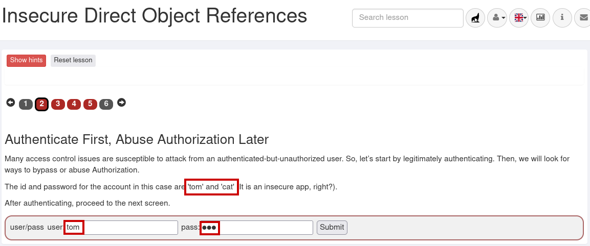
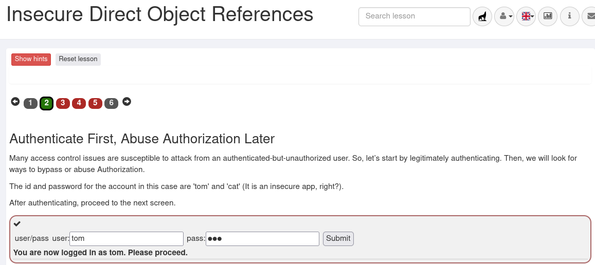

#### Крок 2. Спостереження відмінностей у відповіді сервера
Натискаємо кнопку **"View Profile"**:

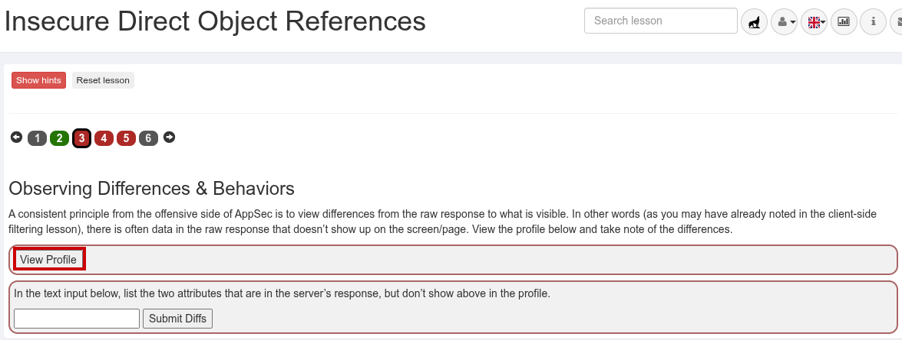

Перед цим у Burp Suite вмикаємо перехоплення запитів (**Intercept**) на вкладці **Proxy**:

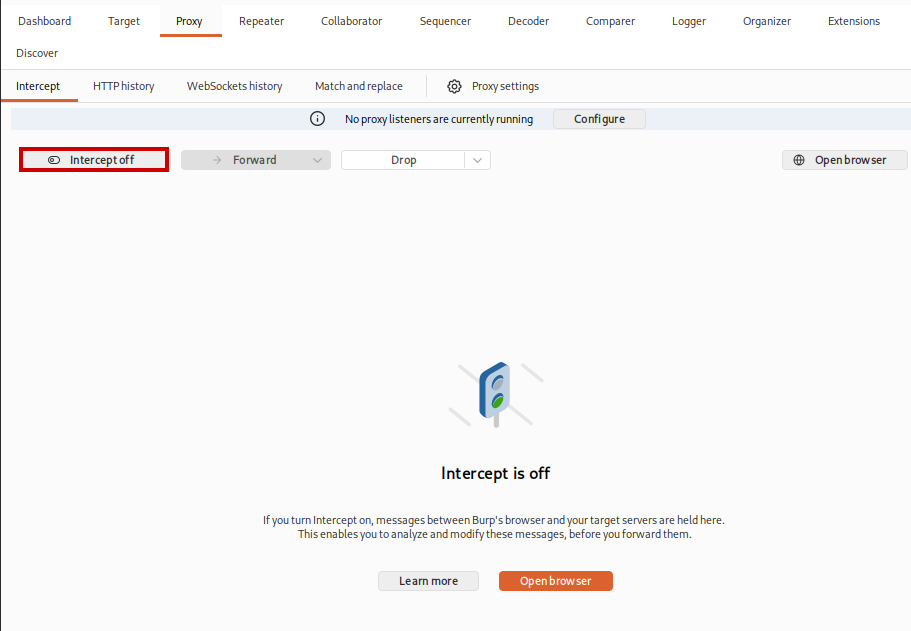

Знаходимо необхідний перехоплений запит **GET /WebGoat/IDOR/profile** та відправляємо його у **Repeater**:

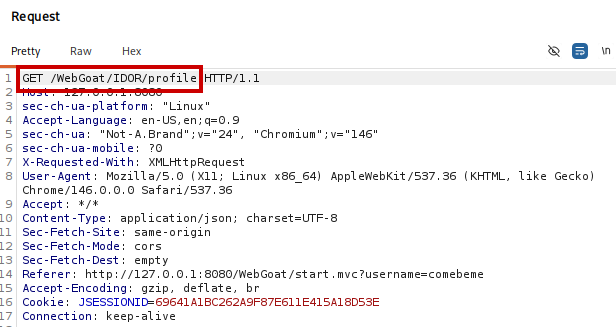

Надсилаємо за допомогою кнопки **Send**
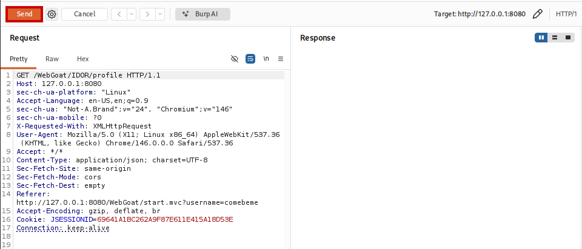

У відповіді сервера бачимо, що окрім даних, які відображаються на екрані (ім'я, колір, розмір), сервер повертає ще й додаткові поля — **role** та **userId**, яких немає у видимій частині профілю:

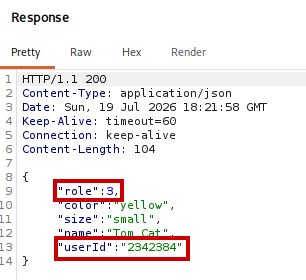

Вписуємо знайдені "приховані" атрибути (`role`, `userId`) у відповідне поле уроку — крок зараховано:

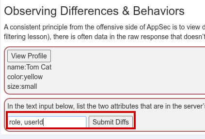
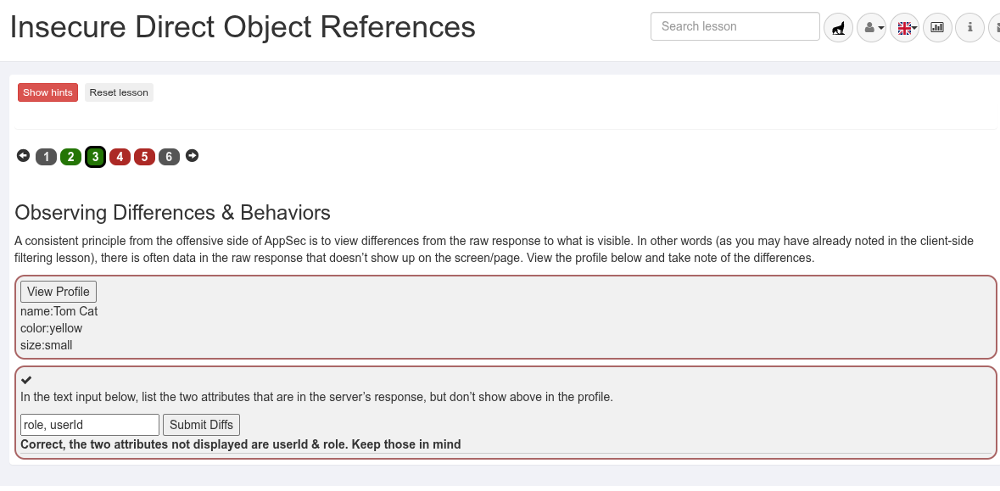

#### Крок 3. Вгадування та передбачення шаблону
Урок пропонує здогадатись, яким чином можна явно звернутись до власного профілю через прямий ідентифікатор об'єкта. Виходячи з RESTful-підходу і знайденого значення **userId**, формуємо шлях виду `WebGoat/IDOR/profile/{userId}`:

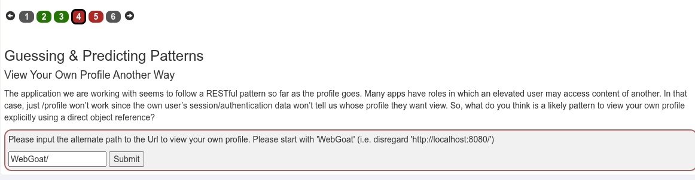
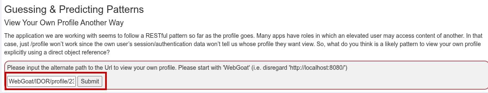

Підставивши свій **userId**, отримуємо підтвердження — цей шаблон коректний, і крок пройдено:

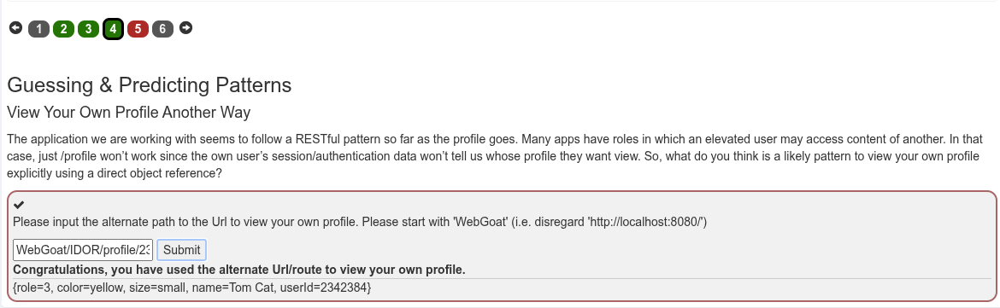

#### Крок 4. Перегляд чужого профілю
Тепер, знаючи шаблон `/profile/{userId}`, спробуємо застосувати його до **чужого** акаунта — Buffalo Bill. Урок пропонує скористатись кнопкою **"View Profile"** та перехопити/змінити запит:

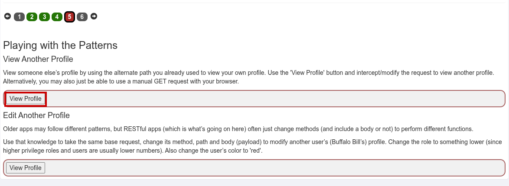

Перехоплюємо запит, у якому Burp автоматично підставив плейсхолдер **{userId}** замість реального значення:

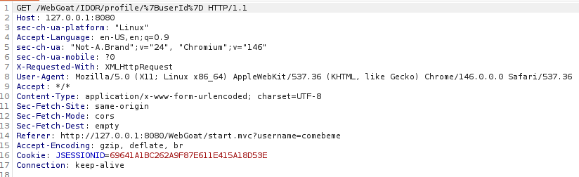

Відправляємо цей запит в **Intruder**, позначаємо позицію payload на числовому значенні **userId** (кнопка **Add §**) і задаємо перебір послідовних значень навколо відомого нам ID:

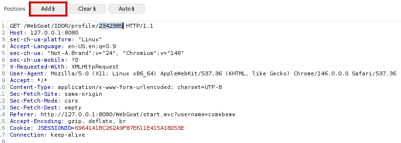
![payload_settings] (images/16_payload_swt.png)

Запускаємо атаку. Серед відповідей помічаємо один запит із **іншою довжиною відповіді (448 замість 384)** — це і є профіль іншого користувача:

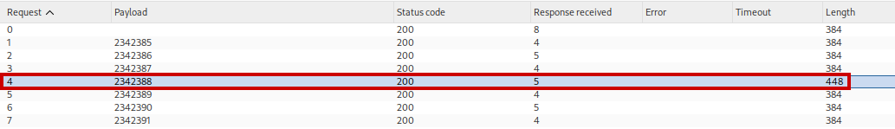

Перевіряємо тіло відповіді — сервер підтверджує, що знайдено чужий профіль (**Buffalo Bill**), і крок зараховано:

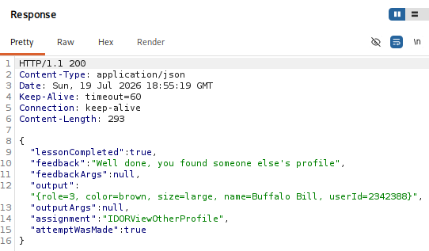

#### Крок 5. Редагування чужого профілю
За завданням потрібно не лише переглянути, а й **відредагувати** профіль Buffalo Bill: понизити роль (вищі привілеї відповідають меншим номерам ролі) та змінити колір на **"red"**. Оскільки застосунок є RESTful, для редагування замість методу **GET** використовуємо **PUT** (Доступні методи можна найти, банально за допомогою спроби запиту за методом, що не підтримується), зберігаючи той самий шлях і додаючи тіло запиту (**payload**) у форматі JSON. Запит формуємо в **Repeater** на основі свіжого (актуального за **JSESSIONID**) запиту:

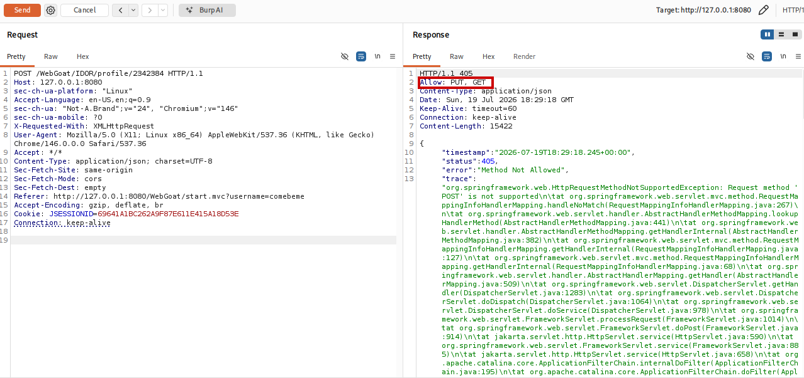
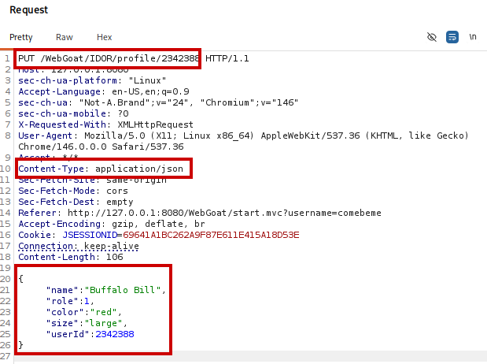

Перша спроба (пониження ролі з 3 до 2) виявилась недостатньою — сервер підказує спробувати ще нижчу роль, тож коригуємо значення **role** до **1**:

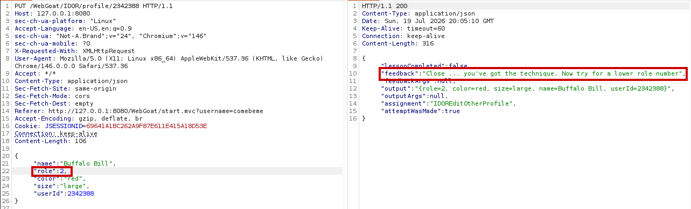
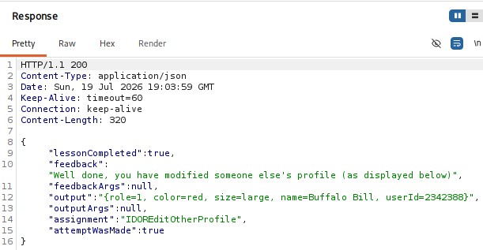

Після виправлення отримуємо успішну відповідь від сервера — профіль Buffalo Bill відредаговано, роль знижено, колір змінено на червоний. Відповідно змінюється й прогрес проходження уроку:

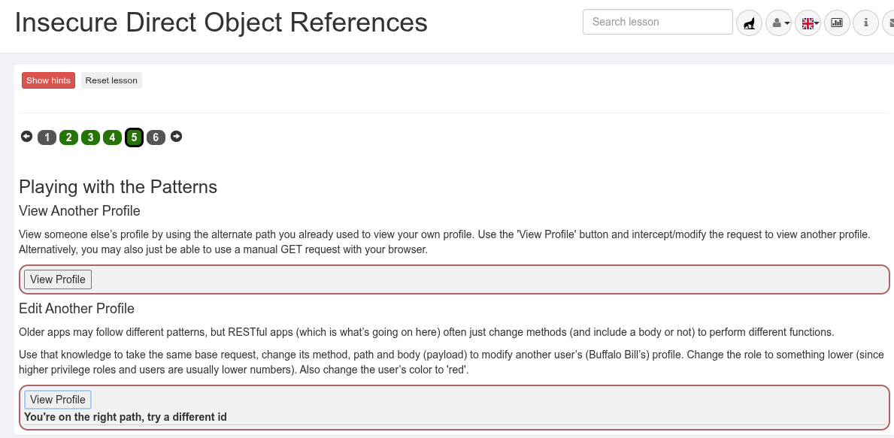

### Висновок

Лабораторну роботу виконано успішно. На прикладі уроку **Insecure Direct Object References** було продемонстровано, як відсутність належної перевірки прав доступу на сервері дозволяє, знаючи лише шаблон побудови URL/шляху та ідентифікатор об'єкта (**userId**), переглядати («горизонтальне» порушення контролю доступу) та навіть редагувати чужі дані, підвищуючи при цьому власні привілеї («вертикальне» порушення). Використання **Burp Suite** (Proxy, Repeater, Intruder) дозволило виявити приховані в "сирій" відповіді сервера поля, підібрати правильний ідентифікатор методом перебору та сформувати відповідний **PUT**-запит для модифікації чужого профілю.
